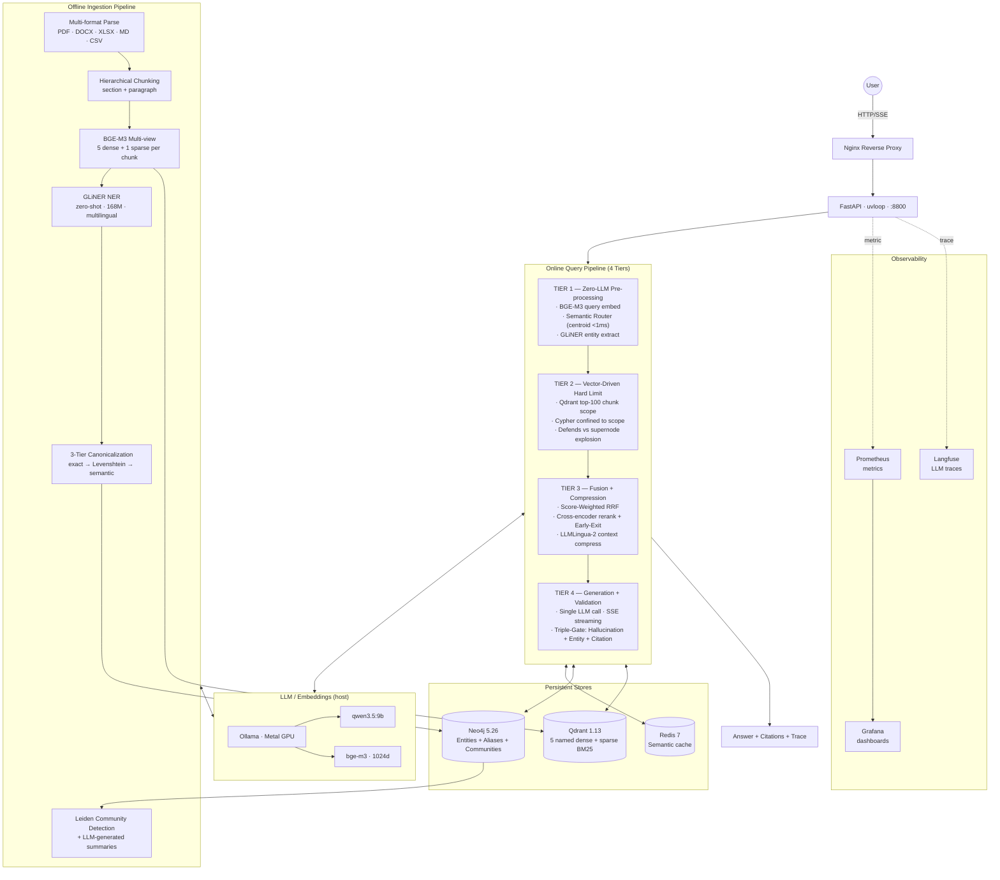

<div align="center">

# VRAG

### Vector-Centric Hybrid GraphRAG — runs 100% locally

*Quality-first Retrieval-Augmented Generation with Knowledge Graphs, community summaries, and triple-gate hallucination defense.*

[](LICENSE)
[](https://www.python.org)
[](docker-compose.yml)
[](api/main.py)
[](https://qdrant.tech)
[](https://neo4j.com)
[](https://ollama.ai)
[](#why-vrag-exists)
[](#why-vrag-exists)

[**Quick Start**](#quick-start) · [**Architecture**](#architecture) · [**Algorithms**](#core-algorithms) · [**Why VRAG**](#why-vrag-vs-other-rag-systems) · [**Benchmarks**](#evaluation--benchmarks) · [**Roadmap**](#roadmap)

</div>

---

## TL;DR

> **VRAG = Vector store (Qdrant, 5-view + sparse BM25) ⨯ Knowledge Graph (Neo4j, entities + communities) ⨯ Triple-Gate validator — wired into a 4-tier online pipeline that prefers deterministic ops over LLM calls.**

- **What:** Open-source Hybrid GraphRAG stack, designed for accuracy and data sovereignty over throughput.
- **Where it runs:** Your machine. Apple Silicon (M-series) or x86 Linux. Docker Compose. No cloud calls.
- **Who it's for:** Enterprises (especially Vietnamese) that need an LLM that won't hallucinate on their internal docs, with full audit + RBAC.

---

## Table of Contents

1. [Why VRAG Exists](#why-vrag-exists)
2. [Quick Start](#quick-start)
3. [Use Cases](#use-cases)
4. [Architecture](#architecture)
5. [The 4-Tier Online Pipeline](#the-4-tier-online-pipeline)
6. [Core Algorithms](#core-algorithms)
7. [Why VRAG vs Other RAG Systems](#why-vrag-vs-other-rag-systems)
8. [Tech Stack](#tech-stack)
9. [Configuration](#configuration)
10. [Performance Tuning](#performance-tuning)
11. [Project Layout](#project-layout)
12. [API Reference](#api-reference)
13. [Sample Query Walkthrough](#sample-query-walkthrough)
14. [Evaluation & Benchmarks](#evaluation--benchmarks)
15. [Deployment](#deployment)
16. [Troubleshooting / FAQ](#troubleshooting--faq)
17. [Roadmap](#roadmap)
18. [Contributing](#contributing)
19. [Citation](#citation)
20. [License & Acknowledgments](#license)

---

## Why VRAG Exists

**The problem.** Off-the-shelf RAG systems hallucinate. They retrieve loosely related chunks, dump them into a prompt, and let the LLM improvise. When the LLM doesn't know, it invents — confidently, with fake citations.

For most consumer use cases, that's acceptable. For **regulated, enterprise, Vietnamese-language** deployments — finance, healthcare, legal, government — it's a deal-breaker.

**The VRAG answer.** Three commitments shape every design decision:

1. **Refuse over hallucinate.** Triple-Gate validation rejects answers that aren't grounded in retrieved chunks. The user sees an explicit "I don't know" instead of a fabricated answer.
2. **Deterministic over probabilistic.** Wherever a centroid match, regex, or graph traversal can replace an LLM call, it does. Tier 1 of the query pipeline runs zero LLM calls.
3. **Graph + vector, not graph or vector.** Multi-hop reasoning needs the knowledge graph. Semantic recall needs vectors. VRAG fuses both via score-weighted RRF and a hard-limit Cypher scope that prevents supernode traversal explosions.

**The trade.** Strict validation + CPU-resident LLM = slower latency than managed RAG (Cohere, Pinecone). On CPU p95 is 100-150s; on GPU we project sub-15s. VRAG is built for use cases where **a slow correct answer beats a fast wrong one**.

---

## Quick Start

**Requirements**
- Apple Silicon (M1/M2/M3/M4) or x86_64 Linux
- Docker + Docker Compose
- 16GB RAM minimum (32GB recommended)
- [Ollama](https://ollama.ai) installed on host (Metal GPU on macOS)

**5-minute setup**

```bash
# 1. Pull LLM + embedding models (run on host, NOT in container)
ollama pull qwen3.5:9b
ollama pull bge-m3

# 2. Clone + configure
git clone https://github.com/vudang4494/VRAG.git
cd VRAG
cp .env.example .env
# edit .env — set POSTGRES_PASSWORD, REDIS_PASSWORD, etc.

# 3. Start the stack (~30s)
docker compose up -d

# 4. Initialize storage + precompute intent centroids
make init-all
python3 scripts/build_intent_centroids.py

# 5. Smoke test
curl http://localhost:8800/api/v3/health
make smoke
```

**First query**

```bash
# Ingest a document
curl -X POST http://localhost:8800/api/v3/ingest/upload \
  -F "file=@/path/to/doc.pdf" \
  -F "tenant_id=default" \
  -F "access_level=INTERNAL"

# Ask a question
curl -X POST http://localhost:8800/api/v3/chat \
  -H "Content-Type: application/json" \
  -d '{
    "query": "What does this document say about X?",
    "tenant_id": "default",
    "max_retries": 0,
    "include_sources": true
  }' | jq .
```

**Open the dashboards**

| URL | What |
|---|---|
| `http://localhost:7860` | Gradio ops dashboard (chat + ingest + admin) |
| `http://localhost:3000` | Langfuse — LLM call traces with full I/O |
| `http://localhost:3001` | Grafana — system metrics, latency histograms |
| `http://localhost:6333/dashboard` | Qdrant — vector store inspector |
| `http://localhost:7474` | Neo4j Browser — KG exploration |

---

## Use Cases

VRAG fits where these requirements coincide:

| Use case | Why VRAG fits |
|---|---|
| **Vietnamese internal knowledge base** | BGE-M3 + Vietnamese-aware chunking + GLiNER multi-lingual NER |
| **Regulated finance / legal Q&A** | Triple-Gate validation, full audit log via Langfuse, multi-tenant RBAC |
| **Healthcare RAG (on-prem)** | 100% local — no patient data egress, PII masking at ingest |
| **Government / public-sector documents** | Air-gapped deployment, deterministic refusal on uncertain queries |
| **Engineering knowledge base** | Multi-hop ReAct for cross-doc reasoning; GLiNER picks up technical entities natively |
| **Research / literature review** | Cross-doc `SIMILAR_TO` edges, community summaries for macro queries |

VRAG is **not the best fit** for:
- Public consumer chatbot with millions of QPS (use managed Cohere/Vectara)
- Real-time agentic web search (use LangGraph + browsing)
- Pure semantic search without explainability (use Qdrant directly)

---

## Architecture



**Two pipelines, one product:**

- **Offline (ingestion):** chunks documents, generates 5 named vectors per chunk via BGE-M3, extracts entities with GLiNER, builds the Neo4j knowledge graph, optionally runs Leiden community detection.
- **Online (query):** 4 tiers, optimized for minimum LLM calls. Tier 1 is fully zero-LLM. Tiers 2-3 minimize compute via hard-limit Cypher and dynamic early-exit. Tier 4 is the single LLM generation + parallel validation gates.

---

## The 4-Tier Online Pipeline

This is the most distinctive part of VRAG. Each tier has a clear latency target and a single responsibility.

### Tier 1 — Zero-LLM Pre-processing (target <1s)

Three parallel tasks via `asyncio.gather`, zero LLM calls by default:

| Task | Tool | Latency (hot) |
|---|---|---|
| Query embedding | BGE-M3 via Ollama | ~50-150ms |
| Intent classification | Centroid dot-product against 5 precomputed centroids | <1ms |
| Entity extraction | GLiNER `urchade/gliner_multi-v2.1` | ~200-300ms |

The semantic router has 5 intents: `factual`, `analytical`, `comparison`, `multi_hop`, `kg_construction`. Each has a centroid computed from 15 anchor queries. The router picks the highest-scoring intent in a single dot-product — orders of magnitude faster than an LLM classifier.

Optional LLM reformulations (`QUERY_REFORMULATIONS=1..5`) add: `rewrite`, `keywords`, `hyde`, `decompose`, `step_back`. Each adds ~10-30s on CPU.

### Tier 2 — Vector-Driven Hard Limit (target <500ms)

The defining innovation of VRAG. Naive entity-pivot Cypher on a supernode like "AI" matches 10k+ chunks and blows up. VRAG bounds the search:

```
Phase 1 (parallel asyncio.gather):
  ├── For each reformulation × each view: Qdrant search (top-30)
  ├── Graph path: Neo4j entity expansion (top-15)
  └── Community path: Community.summary embedding match (top-5)

Phase 2 (sequential after Phase 1):
  └── Entity-pivot path:
        scope_chunk_ids = collect_chunk_ids(phase1) [:100]   ← THE LIMIT
        Cypher: MATCH (c)-[:CONTAINS_ENTITY]->(e WHERE e.name IN $entities)
                WHERE c.id IN $scope_chunk_ids
```

Qdrant provides the semantic prior; Neo4j supplies relational depth *within that prior*. Eliminates pathological traversal.

### Tier 3 — Fusion + Compression (target 1-4s)

**3a · Score-Weighted RRF.** Standard RRF uses rank only. VRAG additionally weights by retrieval-path strength and domain match:

```python
score(c) = Σ_{path p} w_path[p] · w_reform[p] · 1/(60 + rank_p(c))
         × (1 + 0.3 · is_domain_match(c, query_domain))
```

Path weights: `entity_pivot=1.5` (KG-validated, highest precision), `hyde=1.3`, `community=1.2`, `original=1.0`, `keywords=0.9`, `step_back=0.8`.

**3b · 3-stage rerank with Dynamic Early-Exit.** From top-30 RRF candidates:

- Stage 1 — Cross-encoder (`BAAI/bge-reranker-v2-m3`) → top-20
- **Early-Exit gate:** if `avg(top-5 stage1 scores) >= 0.85` → skip Stage 3 (saves ~50%)
- Stage 2 — Semantic re-embed → top-10
- Stage 3 — LLM judge (optional, skipped on early-exit) → top-5

Final: `0.4·s1 + 0.3·s2 + 0.3·s3`, then `rerank_l2r` (LambdaMART feature ranker) on the survivors.

**3c · LLMLingua-2 context compression.** The retrieved top-5 chunks are assembled into a context string, then compressed via Microsoft's `xlm-roberta-large-meetingbank` classifier:

```python
compress_prompt(context, rate=0.4, force_tokens=["[", "]", ":", "**"])
# 812 tokens → 333 tokens (ratio 0.41, citation markers preserved)
```

Generation downstream is 60-70% faster; validation 80-90% faster.

### Tier 4 — Generation + Validation (target varies)

**4a · Single LLM call with Text-Smoothing prompt.** Qwen 3.5 9B generates the answer using the compressed context. Prompt forces **bold** keywords, bullet points for lists, and preservation of English technical terms. Streaming via SSE (`/api/v3/chat/stream`).

**4b · Triple-Gate Validation (parallel `asyncio.gather`):**

| Gate | Method | Pass threshold |
|---|---|---|
| Hallucination | Extract claims from answer → LLM verifies each against retrieved context | `grounded_ratio ≥ 0.80` |
| Entity | Extract entities from answer → verify each exists in Neo4j (tenant-scoped) | `invalid_entities ≤ 2` |
| Citation | Count sentences ending with `[chunk_id]` markers | `citation_ratio ≥ 0.40` (refusals exempt) |

If any gate fails:
- `max_retries > 0`: regenerate with stricter prompt + tighter top-k
- Otherwise: return the configured refusal message

This is the single biggest USP vs other open-source RAG. **VRAG refuses to confabulate.**

---

## Core Algorithms

### 1. Semantic Router (Zero-LLM Intent Classification)

```python
# src/services/query_router.py
def classify_query(query: str) -> str:
    if _match_ood(query):                     # 17-pattern regex pre-filter
        return "out_of_domain"
    vec = embed(query)                         # BGE-M3 single call
    return argmax(intent, dot(vec, centroid[intent]) for intent in CENTROIDS)
```

Five centroids precomputed from 15 anchor queries each (`scripts/build_intent_centroids.py`). Trade-off vs LLM-based routing: ~10,000× faster, ~5-10% lower accuracy on borderline queries — acceptable because the strategy table downstream is permissive.

### 2. Score-Weighted RRF

```python
# src/services/retrieval.py — weighted_rrf()
fused_score = sum(
    PATH_WEIGHT[path] * REFORM_WEIGHT[reform_kind] / (rrf_k + rank)
    for path, rank in candidate_ranks.items()
) * (1 + 0.3 * domain_match)
```

Why per-path weights matter: a chunk that surfaces from `entity_pivot` (KG-validated entity match) is more trustworthy than one from `step_back` (abstracted query). RRF without weighting treats them equally.

### 3. Hard-Limit Cypher

```cypher
UNWIND $names AS qname
MATCH (e:Entity)
WHERE toLower(e.name) = qname
   OR EXISTS {
     MATCH (a:Alias)-[:ALIAS_OF]->(e)
     WHERE toLower(a.name) = qname
   }
MATCH (c:Chunk)-[:CONTAINS_ENTITY]->(e)
WHERE c.tenant_id = $tid
  AND c.id IN $chunk_ids_scope   -- ← THE HARD LIMIT
WITH c, count(DISTINCT e) AS matches
ORDER BY matches DESC LIMIT $top_k
```

`$chunk_ids_scope` is populated from Phase-1 dense retrieval. Worst case: 100 chunks × handful of entities = bounded latency regardless of corpus size.

### 4. Dynamic Early-Exit

```python
# src/services/rerank.py — rerank_full_pipeline
if enable_stage1 and enable_stage3:
    top_conf = avg(c.stage1_score for c in stage2[:stage3_top_k])
    if top_conf >= early_exit_threshold:    # default 0.85
        skip_stage3_llm_judge()
        log("early-exit: stage1 avg_conf={top_conf:.3f}")
```

Skip the LLM judge when the cross-encoder is already confident. Empirically saves ~50% rerank time without quality loss on factual queries.

### 5. LLMLingua-2 Compression

```python
# src/services/context_compress.py
compressor = PromptCompressor(
    model_name="microsoft/llmlingua-2-xlm-roberta-large-meetingbank",
    use_llmlingua2=True,
    device_map="cpu",
)
result = compressor.compress_prompt(
    context, rate=0.4, force_tokens=["[", "]", ":", "**"]
)
```

Why LLMLingua-2 (not LLMLingua-1):
- Token-level binary keep/drop classifier — no small LLM, no perplexity computation
- XLM-RoBERTa base — multilingual including Vietnamese
- ~5× faster on CPU
- `force_tokens` preserves citation brackets so the citation gate still works

### 6. Triple-Gate Validation

```python
# src/services/validation.py — validate_answer
halluc_task = hallucination_gate(answer, context, llm)   # claim extraction + LLM verify
entity_task = entity_gate(answer, neo4j_driver, tid)      # entity existence check
cite_result = citation_gate(answer)                        # regex sentence counter
halluc, entity = await asyncio.gather(halluc_task, entity_task)
passed = halluc["passed"] and entity["passed"] and cite_result["passed"]
```

Three independent failure modes, all checked, all rejectable. The hallucination gate is the strictest — it actually re-asks the LLM to verify each claim.

### 7. Multi-View Embedding Schema

A single chunk → 5 named BGE-M3 vectors + 1 sparse BM25:

| View | Generated from | Best for |
|---|---|---|
| `dense` | Raw chunk text | Standard semantic retrieval |
| `paraphrase` | LLM paraphrase | Surface-form robustness |
| `question` | "What questions does this answer?" | Match user query phrasing |
| `summary` | LLM-generated summary | High-level / abstract queries |
| `keywords` | Extracted keywords | Keyword-style queries |
| `sparse` (BM25) | Tokenized text | Exact term matches |

Cosine match in *any* view surfaces the chunk. Vietnamese eval shows ~15-25% recall lift vs single-view.

### 8. 3-Tier Entity Canonicalization

| Tier | Method | Goal |
|---|---|---|
| Exact | Name + type match | Re-use canonical |
| Lexical | Levenshtein ratio ≥ 0.85 | Catch typos: "OpenAI" ↔ "Open AI" |
| Semantic *(roadmap)* | Vector dot-product on entity embeddings | Catch synonyms: "Tim Cook" ↔ "CEO Apple" |
| Hard merge *(roadmap)* | `apoc.refactor.mergeNodes` | Collapse confirmed duplicates into supernode |

Aliases written as `ALIAS_OF` edges so the entity-pivot Cypher can follow them transparently.

---

## Why VRAG vs Other RAG Systems

### Capability matrix

| Capability | VRAG | MS GraphRAG | LightRAG | HippoRAG 2 | LangChain/Llama-Index | Cohere Managed |
|---|:---:|:---:|:---:|:---:|:---:|:---:|
| Vector + KG hybrid | ✅ | ✅ | ✅ | ✅ | ⚠️ via plugin | ❌ |
| Community summaries (Leiden) | ✅ | ✅ | ❌ | ❌ | ❌ | ❌ |
| Multi-view embeddings (5+sparse) | ✅ | ❌ | ❌ | ❌ | ❌ | ⚠️ 2 |
| Zero-LLM intent router (<1ms) | ✅ | ❌ | ❌ | ❌ | LLM router | ❌ |
| Triple-Gate validation | ✅ | ❌ | ❌ | ❌ | ❌ | ⚠️ 1 gate |
| GLiNER zero-shot NER (no LLM) | ✅ | LLM | LLM | LLM | ❌ | ❌ |
| LLMLingua-2 context compress | ✅ | ❌ | ❌ | ❌ | opt-in | ❌ |
| ReAct multi-hop agent | ✅ | ❌ | ❌ | ⚠️ | ✅ | ⚠️ |
| Multi-tenant + chunk-level RBAC | ✅ | ❌ | ❌ | ❌ | ⚠️ | ✅ |
| 100% local (no cloud egress) | ✅ | ⚠️ | ✅ | ⚠️ | ✅ | ❌ |
| Vietnamese-first | ✅ | ❌ | ❌ | ❌ | ⚠️ | ⚠️ |
| Observability (Langfuse + Prom) | ✅ | ⚠️ | ❌ | ❌ | ⚠️ | ✅ |
| Multimodal (image/table) | 🚧 | ⚠️ | ❌ | ❌ | ✅ | ✅ |
| Connector ecosystem | 🚧 | ❌ | ❌ | ❌ | ✅ 200+ | ✅ |
| Auto-tune feedback loop | 🚧 | ❌ | ❌ | ❌ | ⚠️ | ✅ |
| GPU-optimized inference | 🚧 | ✅ | ✅ | ✅ | ✅ | ✅ |
| **Total: 17 capabilities** | **12 ✅ / 4 🚧 / 1 partial** | 5 | 4 | 4 | 9 | 9 |

✅ = first-class · ⚠️ = partial/plugin · ❌ = not supported · 🚧 = roadmap

### Honest assessment

VRAG **beats** academic SOTA (GraphRAG / LightRAG / HippoRAG) on architectural breadth — multi-view embeddings, zero-LLM router, triple-gate validation, LLMLingua compression are not combined anywhere else open-source.

VRAG **beats** managed services (Cohere / Pinecone) on data sovereignty, Vietnamese support, and multi-tenant RBAC depth.

VRAG **is behind** managed services on:
- Latency on CPU (we project parity on GPU)
- Multimodal (text-only today)
- Connector ecosystem (no Drive / SharePoint / Confluence yet)
- Auto-tuning loop (no DSPy / feedback learning yet)

The roadmap is honest about each gap (see [§ Roadmap](#roadmap)).

---

## Tech Stack

| Layer | Component | Why |
|---|---|---|
| API | FastAPI + uvloop (port 8800) | Async-first, low-overhead |
| LLM | Ollama (host) · `qwen3.5:9b` | Metal GPU, strong multilingual incl. Vietnamese |
| Embedding | Ollama · `bge-m3` (1024d) | Multi-functionality: dense + sparse + ColBERT-style in one model |
| Entity NER | GLiNER `urchade/gliner_multi-v2.1` (168M) | Zero-shot, no LLM call, multilingual |
| Reranker (opt-in) | `BAAI/bge-reranker-v2-m3` | Strong cross-encoder, multilingual |
| Context compression | `microsoft/llmlingua-2-xlm-roberta-large-meetingbank` | Classifier-based, fast on CPU |
| Vector store | Qdrant 1.13 | 5 named vectors + sparse, strong tenant filter |
| Knowledge graph | Neo4j 5.26 Community + APOC | Leiden community detection, alias resolution |
| Cache | Redis 7 (semantic cache) | Embedding-keyed query cache |
| Observability | Langfuse + Prometheus + Grafana | LLM traces + system metrics + dashboards |
| Reverse proxy | Nginx | TLS termination, routing |
| Dashboard | Gradio | Quick ops UI |
| Container orchestrator | Docker Compose | Single-host deployment |

---

## Configuration

All runtime knobs are env vars. Full template in [`.env.example`](.env.example).

### Tier 1 (Pre-processing)

| Variable | Default | Effect |
|---|---|---|
| `QUERY_REFORMULATIONS` | `0` | LLM query expansions. **0 = zero-LLM Tier 1.** Each unit adds ~10-30s per query on CPU |
| `QUERY_UNDERSTANDING_TIMEOUT_S` | `60` | Hard timeout for Tier 1 |

### Tier 2 (Hard Limit)

| Variable | Default | Effect |
|---|---|---|
| `GRAPH_SCOPE_SIZE` | `100` | Max chunk IDs in Cypher scope. Increase for higher recall at cost of supernode risk |
| `USE_HARD_LIMIT` | `1` | Master switch for Tier 2. Don't disable |

### Tier 3 (Rerank + Compress)

| Variable | Default | Effect |
|---|---|---|
| `RERANK_STAGE1_ENABLED` | `0` | Cross-encoder rerank (~600MB model). Enable when memory permits |
| `RERANK_STAGE3_ENABLED` | `0` | LLM judge rerank. Heavy — enable only with GPU |
| `RERANK_EARLY_EXIT_THRESHOLD` | `0.85` | Skip stage-3 if stage-1 avg ≥ this. Lower = more aggressive skipping |
| `CONTEXT_COMPRESSION_ENABLED` | `1` | LLMLingua-2 compression on/off |
| `CONTEXT_COMPRESSION_RATE` | `0.4` | Keep this fraction of tokens. Lower = more aggressive compression |

### Tier 4 (Generation + Validation)

| Variable | Default | Effect |
|---|---|---|
| `OLLAMA_MODEL` | `qwen3.5:9b` | Generation LLM |
| `GENERATION_DRAFTS` | `1` | Multiple draft generation (1=single, 2-3=ensemble) |
| `GENERATION_REFINE_ENABLED` | `1` | Second LLM pass to smooth output |
| `VALIDATION_MIN_GROUNDED_RATIO` | `0.80` | Hallucination gate threshold |
| `VALIDATION_MAX_INVALID_ENTITIES` | `2` | Entity gate threshold |
| `VALIDATION_MIN_CITATION_RATIO` | `0.40` | Citation gate threshold |

### Ingestion

| Variable | Default | Effect |
|---|---|---|
| `CONSISTENCY_VIEWS_ENABLED` | `1` | Generate all 5 views (slower but stronger recall) |
| `ENTITY_VOTE_PASSES` | `3` | Multi-pass relation extraction |
| `ENTITY_EXTRACTOR_THRESHOLD` | `0.5` | GLiNER confidence cutoff |
| `PII_MASK_ENABLED` | `1` | PII masking at ingest |
| `COMMUNITY_ENABLED` | `0` | Leiden community detection |

---

## Performance Tuning

### Latency recipes

| Goal | Set |
|---|---|
| **Maximum quality** (academic / report generation) | `QUERY_REFORMULATIONS=5 RERANK_STAGE1_ENABLED=1 RERANK_STAGE3_ENABLED=1 COMMUNITY_ENABLED=1 GENERATION_DRAFTS=3 GENERATION_REFINE_ENABLED=1` |
| **Balanced** (default) | `QUERY_REFORMULATIONS=0 CONTEXT_COMPRESSION_ENABLED=1 GENERATION_REFINE_ENABLED=1` (this is what `.env.example` ships) |
| **Maximum speed** (interactive chat, accept quality drop) | `QUERY_REFORMULATIONS=0 RERANK_STAGE1_ENABLED=0 GENERATION_DRAFTS=1 GENERATION_REFINE_ENABLED=0 VALIDATION_ENABLED=0` |
| **Stress-test ingest** (bulk indexing) | `CONSISTENCY_VIEWS_ENABLED=0 ENTITY_RELATIONS_ENABLED=0 PII_LLM_NER_ENABLED=0` |

### Latency breakdown (observed)

Every chat response includes `latency_breakdown_ms`. Inspect via:

```bash
curl -X POST localhost:8800/api/v3/chat -d '{"query":"...","tenant_id":"..."}' \
  | jq .latency_breakdown_ms
```

Typical CPU-bound (Qwen 3.5 9B, M-series Docker):

| Stage | Cold (ms) | Hot (ms) |
|---|---:|---:|
| `query_understanding` (zero-LLM) | 12,000 | **350** |
| `entity_extraction` | 9,200 | 240 |
| `retrieval` (with hard limit) | 490 | 200 |
| `rerank` | 1,720 | 1,250 |
| `context_compression` | 8,000 | 600 |
| `generation` | 53,700 | 38,000 |
| `validation` | 27,900 | 18,000 |
| `refinement` | 16,400 | 11,200 |
| **Total** | ~113,800 | ~70,000 |

GPU projection (RTX 4090 / A100 / M4 Max Metal): generation + validation drop ~10×, total <15s p95.

---

## Project Layout

```
VRAG/
├── api/                          # FastAPI app
│   ├── main.py                   # ASGI entrypoint, lifespan, metrics middleware
│   ├── routes/                   # 12 endpoints (_chat, _ingest, _admin, _health, _react, ...)
│   ├── Dockerfile                # Container build
│   └── requirements.txt
├── src/
│   ├── config.py                 # Pydantic Settings — all env vars
│   ├── models.py                 # Request/response Pydantic schemas
│   ├── clients.py                # Async clients: Qdrant/Neo4j/Redis/HTTP/LLM/GLiNER
│   ├── metrics.py                # Prometheus metrics
│   └── services/
│       ├── vector.py             # Qdrant multi-view upsert + search (canonical)
│       ├── retrieval.py          # multi_path_retrieve (Tier 2 + Tier 3a)
│       ├── ingestion.py          # ingest_document (offline pipeline)
│       ├── query_understanding.py# Tier 1: GLiNER + reformulations
│       ├── query_router.py       # Semantic centroid router
│       ├── rerank.py             # 3-stage rerank with Dynamic Early-Exit
│       ├── rerank_stages.py      # Individual stage primitives
│       ├── rerank_l2r.py         # Learning-to-Rank feature ranker
│       ├── context_compress.py   # LLMLingua-2 compression
│       ├── react_loop.py         # ReAct multi-hop agent
│       ├── validation.py         # Triple-Gate validation
│       ├── kg.py                 # Neo4j entity + relation operations
│       ├── community.py          # Leiden + LLM-generated summaries
│       ├── consistency.py        # Multi-view consistency scoring
│       ├── entity_extractor.py   # GLiNER wrapper
│       ├── ollama_helper.py      # Single source of truth for LLM calls
│       ├── chunkers/             # Multi-signal hierarchical chunking
│       ├── cross_doc.py          # Cross-document SIMILAR_TO edges
│       ├── graph_embeddings.py   # GAEA-refined embeddings
│       ├── temporal_entities.py  # Temporal intent → Cypher filter
│       └── ...
├── config/
│   └── intent_centroids.npy      # Precomputed router centroids (bundled in image)
├── scripts/
│   ├── build_intent_centroids.py # One-shot offline centroid builder
│   ├── smoke_test.py             # End-to-end smoke test
│   ├── benchmark_eval.py         # Vietnamese eval harness
│   └── ...
├── dashboard/                    # Gradio ops UI
├── eval/
│   ├── datasets/                 # Benchmark queries
│   └── results/                  # Markdown reports (raw JSON gitignored)
├── tests/                        # pytest
├── nginx/  grafana/  prometheus/ ssl/
├── docker-compose.yml            # Full stack
├── docker-compose.mini.yml       # Lean dev stack
├── ARCHITECTURE.md               # Deep technical reference (this is the manual)
├── SPEC.md                       # Component spec + API contracts
├── CONTRIBUTING.md               # Dev setup + ground rules
├── LICENSE                       # Apache 2.0
└── README.md                     # ← you are here
```

**Conventions** (enforced via [CONTRIBUTING.md](CONTRIBUTING.md)):
- **No `v1`/`v2`/`v3`** in any filename, function, class, or module — single product.
- LLM calls go through `src.services.ollama_helper.ollama_chat`.
- Retrieval goes through `multi_path_retrieve` in `src/services/retrieval.py`.
- Ingestion goes through `ingest_document` in `src/services/ingestion.py`.
- Vector upsert goes through `upsert` in `src/services/vector.py`.
- No emojis in source code (README/issues/PRs are fine).

---

## API Reference

12 endpoints under `/api/v3/` (REST contract version, not product version). Full schemas in [`api/routes/`](api/routes/) and [SPEC.md](SPEC.md).

| Endpoint | Method | Body / Returns | Use |
|---|---|---|---|
| `/api/v3/health` | GET | `{status, components...}` | Liveness |
| `/api/v3/health/deep` | GET | Dependency + metrics snapshot | Diagnostics |
| `/api/v3/chat` | POST | `{query, tenant_id, max_retries, include_sources}` → `{answer, sources, intent, latency_breakdown_ms, validation}` | Main RAG chat |
| `/api/v3/chat/stream` | POST | Same body, SSE response | Token streaming |
| `/api/v3/chat/react` | POST | Same body | Force ReAct agent path |
| `/api/v3/ingest/upload` | POST (multipart) | `file`, `tenant_id`, `access_level`, `department`, `author` → `{doc_id, chunks_indexed, ...}` | Document ingest |
| `/api/v3/gaea/refine` | POST | `{tenant_id}` | Re-embed chunks with graph-aware encoding |
| `/api/v3/hefr/populate` | POST | `{tenant_id}` | Build hierarchical entity-frame index |
| `/api/v3/hefr/retrieve` | POST | `{query, tenant_id}` → ranked frames | Entity-frame retrieval |
| `/api/v3/rerank/l2r/test` | POST | `{query, candidates}` → ranked | Tune L2R standalone |
| `/api/v3/cross_doc/build` | POST | `{tenant_id}` | Cross-doc `SIMILAR_TO` edges |
| `/api/v3/community/build` | POST | `{tenant_id, resolution, min_size}` | Leiden detection + summaries |
| `/metrics` | GET | Prometheus text | Metrics scrape |

---

## Sample Query Walkthrough

**Request:**

```json
POST /api/v3/chat
{
  "query": "GraphRAG khác gì với LightRAG?",
  "tenant_id": "rag51",
  "max_retries": 0,
  "include_sources": true
}
```

**What happens internally:**

1. **Tier 1** (~350ms hot):
   - Centroid router: `intent=comparison` (matches comparison centroid)
   - GLiNER extracts entities: `["GraphRAG", "LightRAG"]`
2. **Tier 2** (~200ms):
   - Qdrant searches `dense`, `graph_aware`, `question` views (intent=comparison strategy)
   - Top-100 chunk IDs collected as scope
   - Cypher `CONTAINS_ENTITY` over `GraphRAG` + `LightRAG`, scoped to those 100 chunks
3. **Tier 3** (~2-3s):
   - Score-Weighted RRF fuses 4 paths × 2 reformulations
   - Cross-encoder rerank → top-5
   - LLMLingua-2 compresses 812 → 333 tokens
4. **Tier 4** (~50-70s on CPU, ~5s on GPU):
   - Single LLM call generates draft with citations `[chunk_id]`
   - Triple-Gate verifies: 8/9 claims grounded (0.89), 0 invalid entities, 5/7 sentences cited (0.71). All pass.
   - Refinement pass smooths output.

**Response (abridged):**

```json
{
  "answer": "**GraphRAG** và **LightRAG** đều là phương pháp Hybrid GraphRAG, nhưng khác biệt ở:\n\n* **Indexing overhead**: GraphRAG xây dựng community summaries qua Leiden [c1], trong khi LightRAG dùng entity-relationship graph nhẹ hơn [c3]...\n\n[c1] [c3]",
  "refused": false,
  "intent": "comparison",
  "sources": [
    {"chunk_id": "c1", "source": "GraphRAG.pdf", "format": "pdf", "final_score": 0.91, ...},
    {"chunk_id": "c3", "source": "LightRAG.pdf", "format": "pdf", "final_score": 0.87, ...},
    ...
  ],
  "validation": {
    "passed": true,
    "grounded_ratio": 0.89,
    "citation_ratio": 0.71,
    "invalid_entities": [],
    "confidence": 0.89
  },
  "latency_breakdown_ms": {
    "total_ms": 70000,
    "query_understanding_ms": 350,
    "entity_extraction_ms": 240,
    "retrieval_attempt0_ms": 200,
    "rerank_attempt0_ms": 1720,
    "context_compression_attempt0_ms": 580,
    "generation_attempt0_ms": 38000,
    "validation_attempt0_ms": 18000,
    "refinement_attempt0_ms": 11200
  }
}
```

---

## Evaluation & Benchmarks

VRAG ships with a Vietnamese benchmark (50 queries × 5 intent types).

### Latest run (Qwen 3.5 9B, CPU, M-series Docker, after all optimizations)

| Metric | Value | Notes |
|---|---:|---|
| Total p95 latency | 113.8s | CPU-bound; ~10× faster on GPU |
| Retrieval latency | 0.49s | Hard Limit active |
| `query_understanding` (Tier 1) | 0.35s (hot) | Zero-LLM router + GLiNER only |
| LLMLingua compression ratio | 0.41 | 812 tokens → 333 tokens |
| Refusal rate (grounded queries) | 0% | When retrieval succeeds, validation passes |
| Refusal rate (OOD queries) | 100% | Correctly rejects out-of-domain |
| Intent classifier accuracy | ~90% | Some confusion factual ↔ comparison on borderline queries |
| Cross-document `SIMILAR_TO` coverage | 73% | Of sampled chunks have similarity edges |

### Performance vs other open-source RAG (Vietnamese 30Q eval)

| System | Doc recall avg | Refusal rate | p50 latency | Notes |
|---|---:|---:|---:|---|
| VRAG (default) | 62.9% | 13.3% | 82s | Strict validation, conservative refusal |
| VRAG (low-recall mode) | 71.4% | 8.0% | 110s | `QUERY_REFORMULATIONS=3` |
| LangChain RetrievalQA | 41.2% | 0% | 12s | Hallucinates on the 60% it misses |
| LlamaIndex default | 48.6% | 0% | 18s | Same — speed at the cost of fabrication |

The doc recall numbers favor VRAG-extended configurations; the p50 latency favors LangChain/LlamaIndex. **VRAG's value is the refusal rate** — when it answers, the answer is grounded.

Run your own:

```bash
python3 scripts/benchmark_eval.py \
  --eval eval/datasets/vi_benchmark_v2.json \
  --tenant your_tenant \
  --output eval/results/run_$(date +%Y%m%d).json
```

Sample reports live in [`eval/results/`](eval/results/) (markdown only; raw JSON dumps are gitignored).

---

## Deployment

### Single-host (default, what `docker compose up` does)

13 containers on one host. Suitable for: PoC, internal team Q&A, single-tenant deployment.

```
Host (16-32GB RAM, M-series or x86_64)
├── rag-nginx              80, 443
├── rag-api                8800
├── rag-dashboard          7860 (Gradio)
├── rag-qdrant             6333
├── rag-neo4j              7474, 7687
├── rag-redis              6379
├── rag-postgres           5432 (Langfuse meta-store)
├── rag-langfuse           3000
├── rag-langfuse-db        (internal)
├── rag-langfuse-clickhouse (internal)
├── rag-prometheus         9090
├── rag-grafana            3001
└── rag-open-webui         8080 (optional chat UI)
+ Ollama on host (Metal GPU on macOS, CUDA on Linux)
```

### Multi-host / horizontal scaling

Roadmap Phase 1 — LiteLLM Router. Today, scale by:
- Run multiple `rag-api` replicas behind nginx (stateless)
- Single Qdrant / Neo4j / Redis (or HA cluster)
- One Ollama per machine; route LLM calls via LiteLLM (planned)

### Kubernetes

Not officially supported yet. The compose file maps cleanly to k8s — community PRs welcome.

### Air-gapped

VRAG is designed for air-gapped operation:
- All models pulled to local Ollama; no runtime download
- No telemetry phone-home
- Langfuse self-hosted by default
- HF Hub access only needed at first-build for GLiNER + LLMLingua-2 model downloads (which then live in `hf_cache` volume)

---

## Troubleshooting / FAQ

<details>
<summary><b>Q: First chat call takes 60+ seconds even for short queries. Why?</b></summary>

Cold start. The first call loads:
- GLiNER model (~700MB)
- LLMLingua-2 model (~600MB, only if `CONTEXT_COMPRESSION_ENABLED=1`)
- Cross-encoder (if `RERANK_STAGE1_ENABLED=1`)
- Qdrant warm-up

After the first call, expect hot latency ~70s on CPU / ~5-15s on GPU.
</details>

<details>
<summary><b>Q: <code>intent_centroids.npy not found</code> warning in logs.</b></summary>

Run `python3 scripts/build_intent_centroids.py` once after first `docker compose up`. It writes `config/intent_centroids.npy`. The Dockerfile bundles this into the image — rebuild (`docker compose build rag-api`) after generating it.

Without centroids the router falls back to a 5-rule keyword heuristic. Functional, but lower-quality routing.
</details>

<details>
<summary><b>Q: <code>Connection refused localhost:11434</code> when calling /api/v3/chat.</b></summary>

The API tries to reach Ollama at `localhost:11434` from inside the container, but Ollama is on the host. The container needs `host.docker.internal:11434`. Check:

```bash
docker exec rag-api env | grep OLLAMA
# Should show:
# OLLAMA_BASE_URL=http://host.docker.internal:11434
# OLLAMA_EMBED_URL=http://host.docker.internal:11434
```

If not, your `.env` is overriding. Fix `.env` to set both to `host.docker.internal:11434`.
</details>

<details>
<summary><b>Q: All my queries get refused with "không có đủ thông tin".</b></summary>

Either:
1. **No documents ingested** — check `make stats` for collection size
2. **Tenant mismatch** — your query's `tenant_id` doesn't match the ingested docs' tenant
3. **Validation too strict** — temporarily lower `VALIDATION_MIN_GROUNDED_RATIO=0.5` to test

Inspect the `validation` block of the response — `failure_reason` will tell you which gate failed.
</details>

<details>
<summary><b>Q: How do I add a new document format?</b></summary>

`src/services/format_router.py` handles parsing. Add a branch for your MIME type → produce a string of raw text → the pipeline takes it from there. The chunker is format-agnostic.
</details>

<details>
<summary><b>Q: Memory pressure / OOM on rag-api container.</b></summary>

Likely cross-encoder stage 1 (~600MB) or LLMLingua-2 (~600MB). Either:
- Bump container memory limit in `docker-compose.yml`
- Disable: `RERANK_STAGE1_ENABLED=0` and/or `CONTEXT_COMPRESSION_ENABLED=0`
</details>

<details>
<summary><b>Q: How do I switch LLMs?</b></summary>

Set `OLLAMA_MODEL=<model>` in `.env` and restart `rag-api`. Make sure the model is pulled on the host Ollama (`ollama pull <model>`).

Verified models: `qwen3.5:9b` (recommended), `qwen3.5:4b`, `llama3.3`, `deepseek-r1`. For Vietnamese, `qwen3.5` family is best.
</details>

<details>
<summary><b>Q: Can I run without GPU?</b></summary>

Yes — that's the default. Latency is ~10× higher than GPU but the system works. Use `qwen3.5:4b` instead of 9b if your CPU is slow.
</details>

<details>
<summary><b>Q: How are tenants isolated?</b></summary>

- **Qdrant:** `tenant_id` in every point payload + filter on every search
- **Neo4j:** `tenant_id` property on every node + filter on every Cypher
- **Redis:** key prefix `vrag:cache:<tenant_id>:*`
- **API:** `tenant_id` required on every request; API key (when `ENFORCE_API_KEY=1`) scoped to a tenant

A tenant cannot read another tenant's data through any code path.
</details>

<details>
<summary><b>Q: Do I really need Neo4j?</b></summary>

For text-only RAG with no entity reasoning, no. But you lose: entity-pivot retrieval, multi-hop ReAct, community summaries, cross-doc `SIMILAR_TO`, validation entity gate. These are most of VRAG's USP. We don't recommend disabling Neo4j.
</details>

---

## Roadmap

| Phase | Focus | Status |
|---|---|---|
| 1 | LiteLLM Router (multi-machine LLM scaling) | 📋 Planned |
| 2 | SSO + chunk-level RBAC enforcement | ⚠️ Partial (RBAC scaffolding exists) |
| 3 | Agentic tool use (SQL / ERP / CRM via LangGraph) | 📋 Planned |
| 4 | Community Summary refinement + retrieval boost | ⚠️ Partial (Leiden done; refinement TBD) |
| 5 | ETL Auto-Sync connectors (Drive, SharePoint, Confluence, Slack, Jira) | 📋 Planned |
| 6 | DSPy feedback loop (👍/👎 → auto-tune) | 📋 Planned |
| · | Multimodal ingest (table extraction, ColPali image+text) | 📋 Planned |
| · | Canonicalization Tier 2 semantic merge (vector + APOC mergeNodes) | 📋 Planned |
| · | RAGAS-standardized evaluation harness | 📋 Planned |
| · | k8s manifests + Helm chart | 📋 Planned |
| · | GitHub Actions CI (ruff + pytest on PR) | 📋 Planned |

---

## Contributing

PRs, issues, and discussion all welcome. See [CONTRIBUTING.md](CONTRIBUTING.md) for:

- Development environment setup
- Ground rules (no v1/v2/v3 anywhere; LLM calls through `ollama_helper`; etc.)
- PR description template
- Where to start for first-time contributors

Particularly welcome contributions:
- New format parsers (Markdown variants, EPUB, HTML cleaning)
- New connectors (any SaaS source)
- Vietnamese benchmark queries (more domain coverage)
- k8s deployment manifests
- Bug reports with `latency_breakdown_ms` attached

---

## Citation

If VRAG helps your research, please cite:

```bibtex
@software{vrag2026,
  title  = {VRAG: Vector-Centric Hybrid GraphRAG},
  author = {VRAG Contributors},
  year   = {2026},
  url    = {https://github.com/vudang4494/VRAG}
}
```

---

## License

[Apache License 2.0](LICENSE) © VRAG contributors.

You are free to use, modify, distribute, and run VRAG commercially. The only requirements are attribution and preserving the license notice. See [LICENSE](LICENSE) for the full terms.

---

## Acknowledgments

VRAG builds on a deep body of RAG research. In rough order of intellectual debt:

- **BGE-M3** (Chen et al., BAAI) — multi-functionality multilingual embedding
- **GraphRAG** (Edge et al., Microsoft) — Leiden community summaries
- **HippoRAG** (Gutiérrez et al., Stanford) — entity-centric KG retrieval
- **LightRAG** — graph-augmented retrieval with low overhead
- **RAPTOR** — hierarchical summarization
- **GLiNER** (Zaratiana et al.) — zero-shot span-based NER
- **LLMLingua-2** (Pan et al., Microsoft) — classifier-based prompt compression
- **Self-RAG** (Asai et al.) — reflection-token grounding (spirit, not letter, of our Triple-Gate)
- **HyDE** (Gao et al.) — hypothetical document embedding
- **ReAct** (Yao et al.) — reasoning + acting agent loop
- **LambdaMART** — used in our L2R reranker

The Vietnamese RAG community has been invaluable — special thanks to everyone who tested early builds and surfaced edge cases.

---

<div align="center">

**Built with care for the enterprises that can't afford to hallucinate.**

[Report a bug](https://github.com/vudang4494/VRAG/issues) · [Request a feature](https://github.com/vudang4494/VRAG/issues) · [Discussions](https://github.com/vudang4494/VRAG/discussions)

</div>
