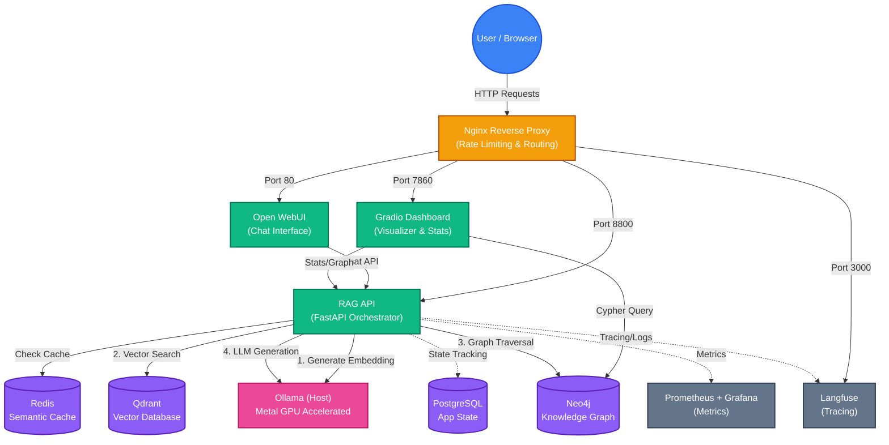

# Enterprise Local RAG Stack v2.0 🚀

A production-ready Retrieval-Augmented Generation (RAG) stack optimized for **Apple Silicon Mac**. This stack runs **100% locally**, ensuring complete data privacy while leveraging the power of Metal GPU acceleration.

## 🌟 Key Features

- **100% Local Inference**: Powered by Ollama with Qwen3.5-4B and BGE-M3 embeddings.
- **Hybrid GraphRAG**: Combines Vector Search (Qdrant) and Knowledge Graphs (Neo4j).
- **Multi-tenant Architecture**: Strict data isolation for enterprise use cases.
- **Visual Dashboard**: Gradio-based hub for Graph visualization and Chat.
- **Observability**: Built-in Langfuse tracing, Prometheus metrics, and Grafana dashboards.

---

## 🏗 System Architecture & Data Flow

Here is the high-level architecture and data flow of the Enterprise RAG Stack:



---

## 🚀 Quick Start Guide

### 1. Prerequisites
- **Hardware:** Apple Silicon Mac (M-series) with 16GB+ Unified Memory.
- **Software:** `brew`, `docker`, `docker-compose`, `make`.

### 2. Setup Ollama (Host)
For maximum Metal GPU performance, Ollama runs natively on the host Mac, not in Docker.
```bash
brew install ollama
ollama pull qwen3.5:4b
ollama pull bge-m3
ollama serve  # Leave this running in a separate terminal
```

### 3. Initialize & Start Stack
Run the following commands in the project root:
```bash
# 1. Generate secure credentials (.env) & Build Docker images
make init

# 2. Start all services via Docker Compose
make up

# 3. Initialize Qdrant and Neo4j schemas
make init-all

# 4. Run full system health check
make health
```
> **Security Note:** All sensitive credentials (API Keys, Passwords) are auto-generated and stored locally in the `.env` file. This file is safely ignored by Git and will **never** be pushed to the repository. No external keys like OpenAI, Claude, or Gemini are hardcoded in the source code.

---

## 🛠 Management Commands

Use the unified `Makefile` for operations:
- `make logs`: View logs for all services.
- `make restart`: Restart the entire stack.
- `make down`: Stop all containers (data is preserved).
- `make test-all`: Run health, embedding, and RAG E2E tests.
- `make test-perf`: Run performance benchmarks.

---

## 🔗 Access Points

Once the stack is up, you can access the localized services at:

| Component | URL | Default Credentials |
|-----------|-----|-------------------|
| **Gradio Dashboard** | `http://localhost:7860` | No auth needed |
| **Open WebUI** | `http://localhost:80` | Create your first admin account |
| **Neo4j Browser** | `http://localhost:7474` | `neo4j` / (check `.env` for password) |
| **Qdrant UI** | `http://localhost:6333/dashboard` | No auth needed |
| **Langfuse** | `http://localhost:3000` | admin@localhost / (check `.env`) |
| **Grafana** | `http://localhost:3001` | `admin` / (check `.env`) |
