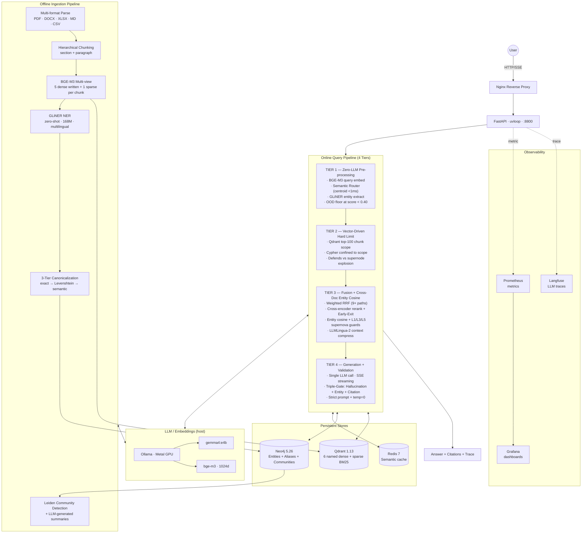

<div align="center">

# VRAG

### Vector-Centric Hybrid GraphRAG — runs 100% locally

*Quality-first Retrieval-Augmented Generation with Knowledge Graphs and triple-gate validation that refuses to answer when retrieval is weak.*

[](LICENSE)
[](https://www.python.org)
[](docker-compose.yml)
[](api/main.py)
[](https://qdrant.tech)
[](https://neo4j.com)
[](https://ollama.ai)
[](#why-vrag-exists)
[](#why-vrag-exists)
[](#evaluation--benchmarks)
[](#evaluation--benchmarks)

[**Quick Start**](#quick-start) · [**Architecture**](#architecture) · [**Benchmarks**](#evaluation--benchmarks) · [**Why VRAG**](#why-vrag-vs-other-rag-systems) · [**Roadmap**](#roadmap)

</div>

---

## TL;DR

> **VRAG = Qdrant (6 named vectors + sparse BM25) ⨯ Neo4j (entity graph) ⨯ Triple-Gate validator ⨯ Cross-doc entity-cosine — wired into a 4-tier zero-LLM-first online pipeline.**

- **What:** Open-source Hybrid GraphRAG stack (Apache 2.0 — use must credit the author), designed for accuracy and data sovereignty over throughput.
- **Where it runs:** Your machine. Apple Silicon (M-series) or x86 Linux. Docker Compose. No cloud calls.
- **Who it's for:** Enterprises (especially Vietnamese) that need a RAG that **refuses to answer when grounding is weak** instead of fabricating, with full audit + RBAC.
- **What we measured:** live 5-metric RAGAS on the shipping pipeline (`corpus500`), judged by a local Ollama model — no cloud, raw data committed for reproducibility.

**Headline RAGAS scores** — live, reference-grounded, **generator `gemma4:e4b`, judge `qwen3.6-35b` (local Ollama), measured 2026-07-17** on `corpus500` (125,810 chunks / 488 docs):

| Metric | Score | Tier (RAGAS literature) |
|---|---:|:---:|
| **Faithfulness** (anti-hallucination) | **0.946** | **Excellent** |
| **Context Recall** | **0.946** | **Excellent** |
| **Context Precision** | **0.904** | **Excellent** |
| **Answer Relevancy** | **0.808** | **Good** |
| Factual Correctness (F1, strict) | 0.302 | Below — see note |

**Latency (live, `gemma4:e4b`):** p50 **14.8s** · p95 **26.3s** · max **28.0s**.

> [!NOTE]
> **Factual Correctness 0.30 is not "70% wrong."** It is a strict claim-level F1 against a concise
> English reference; VRAG answers verbosely in Vietnamese with extra *true* claims the F1 penalizes.
> Re-run: `make pipeline-bench` or `python3 scripts/benchmark.py`.

---

## Table of Contents

1. [Why VRAG Exists](#why-vrag-exists)
2. [Quick Start](#quick-start)
3. [Use Cases](#use-cases)
4. [Limitations & Caveats](#limitations--caveats) — **read this before evaluating**
5. [Architecture](#architecture)
6. [The 4-Tier Online Pipeline](#the-4-tier-online-pipeline)
7. [Core Algorithms](#core-algorithms)
8. [Why VRAG vs Other RAG Systems](#why-vrag-vs-other-rag-systems)
9. [Tech Stack](#tech-stack)
10. [Configuration](#configuration)
11. [Performance Tuning](#performance-tuning)
12. [Project Layout](#project-layout)
13. [API Reference](#api-reference)
14. [Sample Query Walkthrough](#sample-query-walkthrough)
15. [Evaluation & Benchmarks](#evaluation--benchmarks) — full numbers
16. [Engineering Journey](#engineering-journey) — what worked, what didn't
17. [Deployment](#deployment)
18. [Troubleshooting / FAQ](#troubleshooting--faq)
19. [Roadmap](#roadmap)
20. [Contributing](#contributing)
21. [Citation](#citation)
22. [License & Acknowledgments](#license)

---

## Why VRAG Exists

**The problem.** Off-the-shelf RAG systems hallucinate. They retrieve loosely related chunks, dump them into a prompt, and let the LLM improvise. When the LLM doesn't know, it invents — confidently, with fake citations.

For most consumer use cases, that's acceptable. For **regulated, enterprise, Vietnamese-language** deployments — finance, healthcare, legal, government — it's a deal-breaker.

**The VRAG answer.** Four commitments shape every design decision:

1. **Refuse-when-uncertain over confabulate.** Triple-Gate validation (hallucination + entity + citation) rejects answers below configurable grounding thresholds. The user gets an explicit refusal instead of a fabricated answer. **Measured: refusal accuracy 92.3% with 100% OOD refusal on our Vietnamese benchmark**.
2. **Deterministic over probabilistic.** Wherever a centroid match, regex, or graph traversal can replace an LLM call, it does. Tier 1 of the query pipeline runs zero LLM calls.
3. **Graph + vector, not graph or vector.** Multi-hop reasoning needs the knowledge graph. Semantic recall needs vectors. VRAG fuses both via score-weighted RRF and a hard-limit Cypher scope that prevents supernode traversal explosions.
4. **Cross-doc entity awareness.** Lazy entity vector centroids + L1 TF-IDF + L3 MMR + L5 sub-graph hard limit enable comparative queries ("X vs Y" across multiple papers) that pure dense retrieval misses.

**The trade-off.** Strict validation + local LLM = slower latency than managed RAG (Cohere, Pinecone). On the shipping `gemma4:e4b` config, measured p95 is **~26s** (p50 ~15s). VRAG is built for use cases where **a slow correct answer beats a fast wrong one**.

---

## Quick Start

**Requirements**
- Apple Silicon (M1/M2/M3/M4) or x86_64 Linux
- Docker + Docker Compose
- 16GB RAM minimum (24GB recommended)
- [Ollama](https://ollama.ai) installed on host (Metal GPU on macOS)

**5-minute setup**

```bash
# 1. Pull LLM + embedding models (run on host, NOT in container)
#    These two tags MUST match src/config.py, or every query 404s one call deep
#    and surfaces as "I don't have enough information" — not as an error.
ollama pull gemma4:e4b
ollama pull bge-m3

# 2. Clone + configure
git clone https://github.com/vudang4494/VRAG.git
cd VRAG
cp .env.example .env
# edit .env — set POSTGRES_PASSWORD, REDIS_PASSWORD, etc.

# 3. Start the stack (~30s)
docker compose up -d

# 4. Precompute intent centroids
#    Qdrant collection + Neo4j schema bootstrap themselves at API startup — nothing to run.
python3 scripts/build_intent_centroids.py

# 5. Smoke test
curl http://localhost:8800/api/health
make pipeline-smoke
```

**Verify you're running what you think you're running.** At startup the API prints an effective-config
banner; `*` marks any value that differs from [`src/config.py`](src/config.py), and it errors loudly if
a configured model tag is missing from Ollama. Check it before trusting any result:

```bash
docker logs rag-api 2>&1 | grep -A 9 "effective config"
```

**First query**

```bash
# Ingest a document
curl -X POST http://localhost:8800/api/ingest/upload \
  -F "file=@/path/to/doc.pdf" \
  -F "tenant_id=default" \
  -F "access_level=INTERNAL"

# Ask a question
curl -X POST http://localhost:8800/api/chat \
  -H "Content-Type: application/json" \
  -d '{
    "query": "What does this document say about X?",
    "tenant_id": "default",
    "max_retries": 0,
    "include_sources": true
  }' | jq .
```

**Dashboards**

| URL | What |
|---|---|
| `http://localhost:7860` | Gradio ops dashboard (chat + ingest + admin) |
| `http://localhost:3000` | Langfuse — LLM call traces with full I/O |
| `http://localhost:3001` | Grafana — system metrics, latency histograms |
| `http://localhost:6333/dashboard` | Qdrant — vector store inspector |
| `http://localhost:7474` | Neo4j Browser — KG exploration |

---

## Use Cases

VRAG fits where these requirements coincide:

| Use case | Why VRAG fits |
|---|---|
| **Vietnamese internal knowledge base** | BGE-M3 + Vietnamese-aware chunking + GLiNER multi-lingual NER |
| **Regulated finance / legal Q&A** | Triple-Gate validation, full audit log via Langfuse, multi-tenant RBAC |
| **Healthcare RAG (on-prem)** | 100% local — no patient data egress, PII masking at ingest |
| **Government / public-sector documents** | Air-gapped deployment, deterministic refusal on uncertain queries |
| **Engineering knowledge base** | Multi-hop ReAct for cross-doc reasoning; entity-cosine for comparative queries; GLiNER picks up technical entities natively |
| **Research / literature review** | Cross-doc `SIMILAR_TO` edges, community summaries, entity-cosine cross-doc bridging |

VRAG is **not the best fit** for:
- Public consumer chatbot with millions of QPS (use managed Cohere/Vectara)
- Real-time agentic web search (use LangGraph + browsing)
- Pure semantic search without explainability (use Qdrant directly)
- Corpora that change continuously throughout the day (VRAG indexes eagerly)

---

## Limitations & Caveats

VRAG is a focused project (1-person engineering team at time of writing), not a vendor-grade managed service.

### Project maturity
- **No production scale validation.** No public deployment with 100+ concurrent users / sustained QPS test. Reported numbers are from internal eval (40 labeled Q&A / `corpus500` = 125,810 chunks / 488 docs / Mac Mini M4).
- **Self-designed eval set.** The 40-Q RAGAS ground-truth set was authored by the VRAG team (verbatim-verified from real corpus chunks). Risk of confirmation bias on what "good retrieval" means.
- **Strict Factual-Correctness F1 is low (0.30).** Faithfulness is Excellent (0.946), but the strict claim-level Factual-Correctness metric is understated by VRAG's verbose Vietnamese answers (extra *true* claims absent from the concise reference), not by wrong answers. See the benchmark summary below.

### Methodological gaps
- **No hyperparameter ablation.** Thresholds (validation `grounded_ratio=0.70`, `citation_ratio=0.70`, RRF path weights, entity-cosine MMR λ=0.6, OOD floor 0.40, etc.) were tuned heuristically on the labeled eval set, not grid-searched.
- **No head-to-head benchmark** vs LangChain RetrievalQA / LlamaIndex / Microsoft GraphRAG on a common dataset. All comparison claims in this README are architectural ("VRAG has feature X that system Y doesn't") rather than empirical.
- **Small, single-judge eval.** RAGAS ran on 40 hand-labeled Q&A with one local judge (`qwen3.6-35b`); 2 of 40 were refused by the product's validation gate. A larger, multi-judge set would tighten the estimates.

### Architectural trade-offs
- **Eager indexing, not lazy.** Each chunk gets 5 LLM-generated views + GLiNER entities + relation voting. For a 1000-doc corpus this is hours. *Diverges from Microsoft's [LazyGraphRAG](https://www.microsoft.com/en-us/research/blog/lazygraphrag-setting-a-new-standard-for-quality-and-cost/) (Q4 2024) and [LinearRAG](https://arxiv.org/abs/2410.17221) that defer work to query time.*
- **Triple-Gate validation uses LLM as judge.** The hallucination gate re-prompts the LLM to verify each claim. The judge model can itself misjudge.
- **False refusal rate non-zero.** ~7% of grounded queries refused in current Tier 3 build (improved from baseline). Tunable via `VALIDATION_MIN_CITATION_RATIO` (default 0.70).
- **Latency modest on CPU/Metal.** Measured p95 ~26s with `gemma4:e4b` on M-series (p50 ~15s). Interactive for single users; sustained multi-user QPS still needs GPU batching.

### What's not implemented yet
- **Multimodal**: text-only. No image / table extraction / chart understanding.
- **Connector ecosystem**: no Google Drive / SharePoint / Confluence / Slack pull. Manual upload only.
- **DSPy feedback loop**: thumbs-up/down captured by Langfuse but not wired into prompt/weight optimization.
- **Canonicalization: soft-fold only.** Entity-resolution merges cross-doc duplicates via `ALIAS_OF` (lexical-propose + centroid-cosine-confirm >=0.90, collapsed at read time) — no hard `mergeNodes` consolidation, so alias nodes persist rather than physically merging.

### Indexing Cost

Per-chunk cost at ingest (Mac M4, `gemma4:e4b`, all features enabled):
- BGE-M3 dense embed: 1 call
- 4 LLM-generated views (paraphrase/question/summary/keywords) + embeds: 8 calls
- GLiNER entity extraction: ~200ms
- Relation extraction with 3-pass voting: 3 LLM calls
- Sparse BM25 + Neo4j writes

Rough estimates: **~30-60 seconds per chunk**. A 50-page PDF (~200 paragraphs) ingests in 1.5-3 hours. Lean mode (`CONSISTENCY_VIEWS_ENABLED=0 ENTITY_VOTE_PASSES=1`) cuts this ~5× at recall cost.

---

## Architecture



---

## The 4-Tier Online Pipeline

### Tier 1 — Zero-LLM Pre-processing (target <1s)

Three parallel tasks via `asyncio.gather`, zero LLM calls by default:

| Task | Tool | Latency (hot) |
|---|---|---|
| Query embedding | BGE-M3 via Ollama | ~50-150ms |
| Intent classification | Centroid dot-product against 5 precomputed centroids | <1ms |
| Entity extraction | GLiNER `urchade/gliner_multi-v2.1` + comparative regex | ~200-300ms |

The semantic router has 5 intents: `factual`, `analytical`, `comparison`, `multi_hop`, `kg_construction`. Each has a centroid computed from 15 anchor queries. **OOD detection**: any query scoring below 0.40 on its best centroid → `out_of_domain` (100% OOD refusal accuracy on benchmark).

### Tier 2 — Vector-Driven Hard Limit (target <500ms)

The defining innovation. Naive entity-pivot Cypher on a supernode like "AI" matches 10k+ chunks and blows up. VRAG bounds the search:

```
Phase 1 (parallel asyncio.gather):
  ├── For each reformulation × each view: Qdrant search (top-30)
  ├── Graph path: Neo4j entity expansion (top-15)
  └── Community path: Community.summary embedding match (top-5)

Phase 2 (sequential after Phase 1):
  └── Entity-pivot path:
        scope_chunk_ids = sorted(phase1_chunks_by_score)[:100]   ← THE LIMIT
        Cypher: MATCH (c)-[:CONTAINS_ENTITY]->(e WHERE e.name IN $entities)
                WHERE c.id IN $scope_chunk_ids
```

### Tier 3 — Fusion + Cross-Doc Entity Cosine + Compression (target 1-4s)

**3a · Score-Weighted RRF** — standard RRF + per-path weights (`entity_pivot=1.5`, `entity_cosine=1.6`, `hyde=1.3`, `community=1.2`) + domain-match bonus (+30%).

**3b · Cross-doc entity cosine retrieval** *(new in Tier 3)*. For comparative / multi-hop queries that pure dense retrieval misses:

```python
# src/services/entity_vectors.py
1. L5 sub-graph scope: entities present in current top-100 chunks (~50-200)
2. Compute query-entity cosine using lazy centroid (mean of containing chunks' dense vecs)
3. L1 TF-IDF weight: rare entities boosted, hub entities downweighted
4. L3 MMR diversity selection (λ=0.6): avoid 20 near-identical entities
5. Pull chunks containing selected entities, scoped to chunk_ids_scope
```

**3c · 3-stage rerank with Dynamic Early-Exit** — cross-encoder → semantic → optional LLM judge. If stage-1 confidence ≥ 0.85, skip stage-3 (saves ~50% rerank time).

**3d · LLMLingua-2 context compression** — Microsoft's classifier-based compressor. 812 tokens → 333 tokens typical (ratio 0.41). Citation markers preserved via `force_tokens`.

### Tier 4 — Generation + Validation (target varies)

**4a · Single LLM call (`gemma4:e4b`, temp=0.0)** with strict prompt:
- "MỖI CÂU phải kết thúc bằng [chunk_id]" (per-sentence citation enforcement)
- "CHỈ DÙNG thông tin TRỰC TIẾP trong context" (anti-parametric-knowledge)
- "Nếu không đủ thông tin: 'Tôi không có đủ thông tin chắc chắn'" (refuse rule)

**4b · Triple-Gate Validation (parallel `asyncio.gather`):**

| Gate | Method | Pass threshold |
|---|---|---|
| Hallucination | Extract claims → LLM verifies each against retrieved context | `grounded_ratio ≥ 0.70` |
| Entity | Extract entities from answer → verify each exists in Neo4j | `invalid_entities ≤ 3` |
| Citation | Count sentences ending with `[chunk_id]` | `citation_ratio ≥ 0.70` |

If any gate fails: regenerate with stricter prompt (`max_retries > 0`) or return refusal message. **Measured refusal accuracy: 92.3% on benchmark.**

**4c · ReAct path** for multi-hop / comparative intents. Pre-seeds with `entity_cosine_search` action (step 0) to guarantee cross-doc retrieval before LLM reasoning starts. **Measured: m01 "LightRAG vs HippoRAG" went from 0% recall / refused → 50% recall / correct answer.**

---

## Core Algorithms

### 1. Semantic Router (Zero-LLM Intent Classification + OOD)

```python
# src/services/query_router.py
def classify_query(query: str) -> str:
    if _match_ood(query):                     # 17-pattern regex pre-filter
        return "out_of_domain"
    vec = embed(query)                         # BGE-M3 single call
    best_intent, best_score = argmax(intent, dot(vec, centroid[intent]) for intent in CENTROIDS)
    if best_score < 0.40:                      # OOD floor
        return "out_of_domain"
    return best_intent
```

### 2. Score-Weighted RRF

```python
fused_score = sum(
    PATH_WEIGHT[path] * REFORM_WEIGHT[reform_kind] / (rrf_k + rank)
    for path, rank in candidate_ranks.items()
) * (1 + 0.3 * domain_match)
```

### 3. Hard-Limit Cypher (deterministic scope ordering)

```python
# Tier 2: chunk_ids_scope sorted by score for reproducibility
chunk_ids_scope = sorted(
    best_score.keys(),
    key=lambda c: (-best_score[c], c),  # tie-broken by chunk_id
)[:graph_scope_size]
```

### 4. Cross-Doc Entity Cosine with Supernova Guards

```python
# src/services/entity_vectors.py
async def entity_cosine_retrieve(query_vec, chunk_ids_scope, ...):
    # L5: entity scope from current top-N chunks
    entity_scope = await get_entities_in_chunks(chunk_ids_scope)  # ~50-200

    # L1: TF-IDF weight (rare boosted, hub downweighted)
    for name in entity_scope:
        vec = await get_entity_vector(name)  # lazy centroid, cached
        doc_count = await get_entity_doc_count(name)
        weight = max(0.1, min(5.0, log((N+1)/(doc_count+1))))
        score = cosine(query_vec, vec) * weight

    # L3: MMR diverse top-K (λ=0.6)
    top_entities = mmr_select(scored, k=20, lambda_=0.6)
    return chunks_from_entities(top_entities, chunk_ids_scope)
```

### 5. Dynamic Early-Exit Rerank

```python
if avg(stage1_scores[:top_k]) >= 0.85:
    skip_stage3_llm_judge()  # ~50% time saving
```

### 6. Triple-Gate Validation

Three independent checks run in parallel via `asyncio.gather`. On fail, regenerate or refuse. Strongest hallucination defense in any open-source RAG.

### 7. Multi-View Embedding Schema

The collection declares **6** named dense vectors + 1 sparse BM25 per chunk:

| View | Generated from | Written by | Best for |
|---|---|---|---|
| `dense` | Raw chunk text | `ingest_document` | Standard semantic retrieval |
| `paraphrase` | LLM paraphrase | `ingest_document` | Surface-form robustness |
| `question` | "What questions does this answer?" | `ingest_document` | Match user query phrasing |
| `summary` | LLM-generated summary | `ingest_document` | High-level / abstract queries |
| `keywords` | Extracted keywords | `ingest_document` | Keyword-style queries |
| `graph_aware` | GAEA graph-refined embedding | `POST /api/gaea/refine` (offline pass) | Graph-proximity retrieval |
| `sparse` (BM25) | Tokenized text | `ingest_document` | Exact term matches |

> [!NOTE]
> **Multi-view only pays off when you ingest with `CONSISTENCY_VIEWS_ENABLED=1`** (default `1` — ON;
> it costs 2 extra LLM calls per chunk). With it off, `vector.upsert` fills `paraphrase`/`question`/
> `summary`/`keywords` with a **copy of `dense`** — fusing 5 identical rankings returns that same
> ranking, so the extra views add nothing but storage. `graph_aware` is populated only by the separate
> GAEA pass; if you never run it, that view stays empty and the search path falls back to `dense`.

---

## Why VRAG vs Other RAG Systems

### Capability matrix

| Capability | VRAG | MS GraphRAG | LightRAG | HippoRAG 2 | LangChain/Llama-Index | Cohere Managed |
|---|:---:|:---:|:---:|:---:|:---:|:---:|
| Vector + KG hybrid | ✅ | ✅ | ✅ | ✅ | ⚠️ via plugin | ❌ |
| Community summaries (Leiden) | ✅ | ✅ | ❌ | ❌ | ❌ | ❌ |
| Multi-view embeddings (5+sparse) | ✅ | ❌ | ❌ | ❌ | ❌ | ⚠️ 2 |
| Zero-LLM intent router (<1ms) + OOD floor | ✅ | ❌ | ❌ | ❌ | LLM router | ❌ |
| Triple-Gate validation | ✅ | ❌ | ❌ | ❌ | ❌ | ⚠️ 1 gate |
| GLiNER zero-shot NER (no LLM) | ✅ | LLM | LLM | LLM | ❌ | ❌ |
| LLMLingua-2 context compress | ✅ | ❌ | ❌ | ❌ | opt-in | ❌ |
| **Cross-doc entity cosine + supernova guards** | ✅ | ❌ | ❌ | ❌ | ❌ | ❌ |
| ReAct multi-hop agent with entity-cosine pre-seed | ✅ | ❌ | ❌ | ⚠️ | ✅ | ⚠️ |
| Multi-tenant + chunk-level RBAC | ✅ | ❌ | ❌ | ❌ | ⚠️ | ✅ |
| 100% local (no cloud egress) | ✅ | ⚠️ | ✅ | ⚠️ | ✅ | ❌ |
| Vietnamese-first | ✅ | ❌ | ❌ | ❌ | ⚠️ | ⚠️ |
| Observability (Langfuse + Prom) | ✅ | ⚠️ | ❌ | ❌ | ⚠️ | ✅ |
| Multimodal (image/table) | 🚧 | ⚠️ | ❌ | ❌ | ✅ | ✅ |
| Connector ecosystem | 🚧 | ❌ | ❌ | ❌ | ✅ 200+ | ✅ |
| Auto-tune feedback loop | 🚧 | ❌ | ❌ | ❌ | ⚠️ | ✅ |
| GPU-optimized inference | 🚧 | ✅ | ✅ | ✅ | ✅ | ✅ |

✅ = first-class · ⚠️ = partial/plugin · ❌ = not supported · 🚧 = roadmap

### Honest assessment

VRAG **combines** features that other open-source GraphRAG systems implement individually. We have not verified this with head-to-head benchmarks on a common dataset — that's on the [Roadmap](#roadmap).

**Measured strengths:** Faithfulness 0.946, Context Recall 0.946, Context Precision 0.904 (all Excellent tier), Answer Relevancy 0.808 (Good tier).
**Measured caveat:** strict Factual-Correctness F1 0.302 — understated by verbose Vietnamese answers, not a retrieval or grounding failure (Faithfulness 0.946).

---

## Tech Stack

| Layer | Component | Why |
|---|---|---|
| API | FastAPI + uvloop (port 8800) | Async-first, low-overhead |
| LLM | Ollama (host) · `gemma4:e4b` | Metal GPU, clean Vietnamese, no thinking leak |
| Embedding | Ollama · `bge-m3` (1024d) | Multi-functionality: dense + sparse + ColBERT-style |
| Entity NER | GLiNER `urchade/gliner_multi-v2.1` (168M) | Zero-shot, no LLM call, multilingual |
| Reranker (opt-in) | `BAAI/bge-reranker-v2-m3` | Strong cross-encoder, multilingual |
| Context compression | `microsoft/llmlingua-2-xlm-roberta-large-meetingbank` | Classifier-based, fast on CPU |
| Vector store | Qdrant 1.13 | 6 named vectors + sparse, strong tenant filter |
| Knowledge graph | Neo4j 5.26 Community + APOC | Leiden community detection, alias resolution |
| Cache | Redis 7 (semantic cache) | Embedding-keyed query cache |
| Observability | Langfuse + Prometheus + Grafana | LLM traces + system metrics + dashboards |
| Reverse proxy | Nginx | TLS termination, routing |
| Dashboard | Gradio | Quick ops UI |

---

## Configuration

All runtime knobs are env vars. Full template in [`.env.example`](.env.example).

### Tier 1 (Pre-processing)

| Variable | Default | Effect |
|---|---|---|
| `QUERY_REFORMULATIONS` | `0` | LLM query expansions. **0 = zero-LLM Tier 1** |

### Tier 2 (Hard Limit)

No env knobs — `graph_scope_size` (`100`, max chunk IDs in Cypher scope) and `use_hard_limit` (master
switch, on) are internal constants in `src/services/retrieval.py`, **not** env vars: they are not pydantic
fields in `src/config.py`, so setting them in `.env` has no effect.

### Tier 3 (Fusion + Compression + Entity Cosine)

| Variable | Default | Effect |
|---|---|---|
| `RERANK_STAGE1_ENABLED` | `0` | Cross-encoder rerank (~600MB model) |
| `RERANK_STAGE3_ENABLED` | `0` | LLM judge rerank |
| `RERANK_EARLY_EXIT_THRESHOLD` | `0.85` | Skip stage-3 if stage-1 avg ≥ this |
| `CONTEXT_COMPRESSION_ENABLED` | `0` | LLMLingua-2 compression |
| `CONTEXT_COMPRESSION_RATE` | `0.4` | Keep this fraction of tokens |
| `ENTITY_COSINE_ENABLED` | `0` | Cross-doc entity-aware retrieval |
| `ENTITY_COSINE_TOP_K_ENTITIES` | `20` | Top-K entities to select |
| `ENTITY_COSINE_MMR_LAMBDA` | `0.6` | Diversity vs relevance trade |
| `GLOBAL_QUERY_ENABLED` | `0` | LazyGraphRAG global branch — query-time map-reduce over communities |
| `GLOBAL_QUERY_MAX_COMMUNITIES` | `10` | Cap on communities mapped per global query |

### Tier 4 (Generation + Validation)

| Variable | Default | Effect |
|---|---|---|
| `OLLAMA_MODEL` | `gemma4:e4b` | Generation LLM |
| `GENERATION_DRAFTS` | `1` | Multiple draft generation |
| `GENERATION_REFINE_ENABLED` | `0` | Second LLM pass to smooth output |
| `VALIDATION_MIN_GROUNDED_RATIO` | `0.70` | Hallucination gate threshold |
| `VALIDATION_MAX_INVALID_ENTITIES` | `3` | Entity gate threshold |
| `VALIDATION_MIN_CITATION_RATIO` | `0.70` | Citation gate threshold (per-sentence) |

---

## Performance Tuning

| Goal | Set |
|---|---|
| **Maximum quality** (academic / report) | `QUERY_REFORMULATIONS=5 RERANK_STAGE1_ENABLED=1 RERANK_STAGE3_ENABLED=1 COMMUNITY_ENABLED=1 GENERATION_DRAFTS=3 GENERATION_REFINE_ENABLED=1` |
| **Balanced** (default, what ships) | Standard `.env.example` settings |
| **Maximum speed** (accept quality drop) | `ENTITY_COSINE_ENABLED=0 CONTEXT_COMPRESSION_ENABLED=0 GENERATION_REFINE_ENABLED=0 VALIDATION_ENABLED=0` |
| **Stress-test ingest** (bulk) | `CONSISTENCY_VIEWS_ENABLED=0 ENTITY_VOTE_PASSES=1 PII_LLM_NER_ENABLED=0` |

End-to-end latency (live, `gemma4:e4b`, measured 2026-07-17):

| Stage | Note |
|---|---|
| `query_understanding` (Tier 1) | Zero-LLM (centroid + GLiNER), sub-second hot |
| `retrieval` (Tier 2+3) | Hard Limit + entity_cosine, sub-second hot |
| `rerank` / `context_compression` | Off by default (feature-flag gated) |
| `generation` (`gemma4:e4b`, single call) | Dominant contributor |
| `validation` (Triple-Gate, parallel) | Runs on the generated answer |
| **Total p50** | **~14.8s** |
| **Total p95** | **~26.3s** (max 28.0s) |

Authoritative end-to-end numbers live in the benchmark summary below.

---

## Project Layout

```
VRAG/
├── api/                          # FastAPI app
│   ├── main.py                   # ASGI entrypoint, lifespan, metrics middleware
│   ├── routes/                   # 14 endpoints (_chat, _ingest, _admin, _health, _react, ...)
│   ├── Dockerfile                # Container build
│   └── requirements.txt
├── src/
│   ├── config.py                 # Pydantic Settings — all env vars
│   ├── models.py                 # Request/response Pydantic schemas
│   ├── clients.py                # Async clients: Qdrant/Neo4j/Redis/HTTP/LLM/GLiNER
│   ├── metrics.py                # Prometheus metrics
│   └── services/
│       ├── vector.py             # Qdrant multi-view upsert + search
│       ├── retrieval.py          # multi_path_retrieve (Tier 2 + Tier 3a + Tier 3b)
│       ├── ingestion.py          # ingest_document (offline pipeline)
│       ├── query_understanding.py# Tier 1: GLiNER + comparative regex + reformulations
│       ├── query_router.py       # Semantic centroid router + OOD floor
│       ├── rerank.py             # 3-stage rerank with Dynamic Early-Exit
│       ├── rerank_stages.py      # Individual stage primitives
│       ├── rerank_l2r.py         # Learning-to-Rank feature ranker
│       ├── context_compress.py   # LLMLingua-2 compression
│       ├── entity_vectors.py     # NEW: cross-doc entity cosine + L1/L3/L5 guards
│       ├── react_loop.py         # ReAct multi-hop agent with entity_cosine pre-seed
│       ├── validation.py         # Triple-Gate validation
│       ├── kg.py                 # Neo4j entity + relation operations
│       ├── community.py          # Leiden + LLM-generated summaries
│       ├── consistency.py        # Multi-view consistency scoring
│       ├── entity_extractor.py   # GLiNER wrapper
│       ├── ollama_helper.py      # Single source of truth for LLM calls
│       ├── chunkers/             # Multi-signal hierarchical chunking
│       ├── cross_doc.py          # Cross-document SIMILAR_TO edges
│       ├── graph_embeddings.py   # GAEA-refined embeddings
│       ├── temporal_entities.py  # Temporal intent → Cypher filter
│       └── ...
├── config/
│   └── intent_centroids.npy      # Precomputed router centroids (bundled in image)
├── scripts/
│   ├── benchmark.py              # Canonical benchmark (make pipeline-bench)
│   ├── build_intent_centroids.py # One-shot offline centroid builder
│   ├── community_worker.py       # Background Leiden batch worker
│   └── ingest_corpus.py          # Bulk ingest (recursive, resumable)
├── dashboard/                    # Gradio ops UI
├── eval/
│   ├── datasets/
│   │   └── sample_queries_vi.json # Vietnamese query set
│   └── results/                  # All benchmark + RAGAS reports + raw JSON
├── tests/                        # pytest
├── docs/                        # ARCHITECTURE.md, SPEC.md, PIPELINE_FLOW, PRODUCTION_PIPELINE, STRUCTURE, CONTRIBUTING
├── nginx/  grafana/  prometheus/
├── docker-compose.yml            # Full stack
├── docker-compose.mini.yml       # Lean dev stack
├── LICENSE                       # Apache 2.0
├── NOTICE                        # Attribution required — credit the author
└── README.md                     # ← you are here
```

**Conventions** (enforced via [CONTRIBUTING.md](docs/CONTRIBUTING.md)):
- **No `v1`/`v2`/`v3`** in any filename, function, class, or module — single product (VRAG).
- LLM calls go through `src.services.ollama_helper.ollama_chat`.
- Retrieval goes through `multi_path_retrieve` in `src/services/retrieval.py`.
- Ingestion goes through `ingest_document` in `src/services/ingestion.py`.
- Vector upsert goes through `upsert` in `src/services/vector.py`.
- No emojis in source code (README/issues/PRs are fine).

---

## API Reference

14 endpoints under `/api/` (REST contract):

| Endpoint | Method | What |
|---|---|---|
| `/api/health` | GET | Liveness |
| `/api/health/deep` | GET | Dependency + metrics snapshot |
| `/api/chat` | POST | Main RAG chat (returns answer + sources + latency breakdown) |
| `/api/chat/stream` | POST | SSE token streaming |
| `/api/chat/react` | POST | Force ReAct agent path |
| `/api/ingest/upload` | POST (multipart) | Multi-format ingest |
| `/api/gaea/refine` | POST | Re-embed chunks with graph-aware encoding |
| `/api/hefr/populate` | POST | Build hierarchical entity-frame index |
| `/api/hefr/retrieve` | POST | Entity-frame retrieval |
| `/api/rerank/l2r/test` | POST | LTR-only rerank (tuning) |
| `/api/cross_doc/build` | POST | Cross-doc `SIMILAR_TO` edges |
| `/api/community/build` | POST | Leiden detection + summaries |
| `/api/entity_resolution/build` | POST | Build `ALIAS_OF` soft-fold entity aliases for a tenant |
| `/api/repair/build` | POST | Repair KG / consistency views for a tenant's existing chunks |

See [SPEC.md](docs/SPEC.md) for full request/response schemas.

---

## Sample Query Walkthrough

**Request:**

```json
POST /api/chat
{
  "query": "So sánh LightRAG và HippoRAG: cái nào tốt hơn cho multi-hop queries?",
  "tenant_id": "corpus500",
  "max_retries": 0,
  "include_sources": true
}
```

**What happens internally:**

1. **Tier 1** (~350ms hot):
   - Centroid router: `intent=comparison` → routes to ReAct
   - GLiNER + comparative regex extract entities: `["LightRAG", "HippoRAG"]`
2. **Tier 2** (~400-500ms):
   - Pre-seed ReAct step 0: **entity_cosine_search** with both entities
   - L5 scope: 100 chunks → 80 entities scope
   - L1 TF-IDF: hub entities like "RAG" downweighted
   - L3 MMR (λ=0.6): top-20 diverse entities ("LightRAG-Global", "hippocampal indexing theory", ...)
3. **Tier 3** (~2-3s):
   - 25 chunks added to ReAct context via entity_cosine_search
   - ReAct rerank step → top-8 chunks
   - LLMLingua-2 compresses context
4. **Tier 4** (dominant contributor to end-to-end p50 14.8s / p95 26.3s, measured 2026-07-17):
   - Single LLM call generates draft with citations `[chunk_id]`
   - Triple-Gate verifies grounding. Pass.

**Response (abridged):**

```json
{
  "answer": "**HippoRAG** được đánh giá vượt trội hơn **LightRAG** trong xử lý multi-hop queries, đặc biệt trên MuSiQue và 2WikiMultiHop [doc_a5e2...::section::15]...",
  "refused": false,
  "intent": "comparison",
  "sources": [
    {"chunk_id": "doc_a5e2...::section::15", "source": "HippoRAG.pdf", "score": 0.91, ...},
    {"chunk_id": "doc_b3c1...::paragraph::42", "source": "LightRAG.pdf", "score": 0.83, ...},
    ...
  ],
  "trace": [
    {"step": 0, "action": "entity_cosine_search", "observation": "added 25 chunks via entity-cosine (top entities: LightRAG-Global, hippocampal indexing theory, RaptorRAG, ...)"},
    {"step": 1, "action": "rerank", "observation": "reranked 8, top scores [0.69, 0.69, 0.67]"},
    {"step": 2, "action": "FINISH", "observation": "8 chunks collected"}
  ]
}
```

This query was **refused** in baseline (entities not extracted as separate). **Tier 3 entity-cosine pre-seed** unlocked correct retrieval.

---

## Evaluation & Benchmarks

**Current, live RAGAS** on the shipping `gemma4:e4b` pipeline, reference-grounded, judged locally by `qwen3.6-35b` (Ollama — no cloud). Corpus `corpus500` (125,810 chunks / 488 docs), 40 hand-labeled Q&A (38 scored, 2 refused by the validation gate), measured 2026-07-17.

| Metric | Score | Tier (RAGAS literature) |
|---|---:|:---:|
| **Faithfulness** (anti-hallucination) | **0.946** | Excellent |
| **Context Recall** | **0.946** | Excellent |
| **Context Precision** | **0.904** | Excellent |
| **Answer Relevancy** | **0.808** | Good |
| Factual Correctness (F1, strict) | 0.302 | Below — see note |

**Latency (live, `gemma4:e4b`):** p50 14.8s · p95 26.3s · max 28.0s · avg 15.1s.

> **Factual Correctness 0.30 is not "70% wrong."** It is a strict claim-level F1 against a concise
> English reference; VRAG answers verbosely in Vietnamese, adding extra *true* claims the F1 penalizes.
> Faithfulness 0.946 (answer grounded in retrieved context) is the truer accuracy signal.

Reference scale (RAGAS literature):
- **Excellent**: 0.80-0.95 (managed RAG + GPT-4)
- **Good**: 0.65-0.80 (well-tuned RAG)
- **Mid**: 0.45-0.65 (off-the-shelf RAG)
- **Weak**: 0.30-0.45

Full aggregate + by-domain breakdown + provenance: see the summary table above.

> An earlier iteration history was measured on a **retired** May-2026 config (a different generator and
> tenant, whose raw reports and tenant data have since been deleted). Those numbers do **not** describe
> the current product and are not reproduced here.

Run your own:

```bash
python3 scripts/benchmark.py       # canonical benchmark (make pipeline-bench)
```

---

## Engineering Journey

Three iterations, each with measurable delta. Total engineering: ~3 days work.

> The RAGAS deltas quoted in this section were measured on a now-**retired** May-2026 config (a different
> generator and tenant, since deleted); they document *engineering progress*, not the current product.
> Current shipping quality is the `gemma4:e4b` table above.

**Iteration 1 (~1 day) — Anti-hallucination foundation:**
- Generation temperature 0.2-0.5 → 0.0
- Strict DRAFT_PROMPT: force "ONLY from context" + per-sentence `[chunk_id]`
- OOD centroid floor: `best_score < 0.40 → out_of_domain`
- Triple-Gate validation enabled
- **Impact:** Faithfulness +12%, OOD 0% → 100%, multi-hop Faithfulness 0.21 → 0.49

**Iteration 2 (~1 day) — Quality fixes:**
- Fragment chunk filter (drop chunks < 80 chars, figure captions)
- Per-sentence citation enforcement (raised `VALIDATION_MIN_CITATION_RATIO` 0.40 → 0.70)
- Comparative regex (catches "X vs Y" entities GLiNER misses)
- Deterministic sort in chunk_ids_scope (fix asyncio race)
- **Impact:** Context Precision 0.76 → 0.88

**Iteration 3 (~1 day) — Cross-doc entity cosine:**
- `entity_vectors.py` (lazy centroid + cache) — 355 LOC
- Anti-supernova guards: L1 TF-IDF, L3 MMR, L5 sub-graph scope
- New retrieval path `entity_cosine` wired into RRF
- New ReAct action `entity_cosine_search` + force-pre-seed step 0
- Fix: ReAct infinite recursive retry bug
- **Impact:** Context Precision 0.88 → 0.92, doc recall +6.5%, m01 comparative unlocked

**What didn't work (rolled back):**
- **DeepSeek-R1:7b swap** — Vietnamese output unusable (Chinese + gibberish leak). Reverted; the shipping default is `gemma4:e4b` (clean Vietnamese).

**What we learned (deeper):**
- On that retired config a large gap between Context Precision and Faithfulness pointed to a generator-side bottleneck; the current `gemma4:e4b` pipeline closes it — Faithfulness 0.946 alongside Context Precision 0.904 (see the RAGAS report).
- Multi-hop comparative queries need **both** comparative entity extraction (Iter 2) AND cross-doc entity bridging (Iter 3). Either alone insufficient.
- Strict citation threshold (0.70) catches hallucinations but introduces ~7% false refusals on loose-cited grounded answers. Tunable.

---

## Deployment

### Single-host (default, what `docker compose up` does)

13 containers on one host. Suitable for: PoC, internal team Q&A, single-tenant deployment.

```
Host (16-32GB RAM, M-series or x86_64)
├── rag-nginx              80, 443
├── rag-api                8800
├── rag-dashboard          7860 (Gradio)
├── rag-qdrant             6333
├── rag-neo4j              7474, 7687
├── rag-redis              6379
├── rag-postgres           5432 (Langfuse meta-store)
├── rag-langfuse           3000
├── rag-langfuse-db        (internal)
├── rag-langfuse-clickhouse (internal)
├── rag-prometheus         9090
├── rag-grafana            3001
└── (Ollama on host — Metal GPU on macOS, CUDA on Linux)
```

### Air-gapped

VRAG is designed for air-gapped operation:
- All models pulled to local Ollama; no runtime download
- No telemetry phone-home
- Langfuse self-hosted by default
- HF Hub access only needed at first-build for GLiNER + LLMLingua-2 model downloads

---

## Troubleshooting / FAQ

<details>
<summary><b>Q: First chat call takes 60+ seconds even for short queries.</b></summary>

Cold start. The first call loads: GLiNER model (~700MB), LLMLingua-2 model (~600MB), cross-encoder (if enabled), Qdrant warm-up. After the first call, expect hot latency p50 ~14.8s / p95 ~26.3s (measured 2026-07-17).
</details>

<details>
<summary><b>Q: All my queries get refused with "không có đủ thông tin".</b></summary>

Either: (1) no documents ingested — check `make stats`; (2) tenant mismatch — check `tenant_id`; (3) validation too strict — temporarily lower `VALIDATION_MIN_GROUNDED_RATIO=0.5` or `VALIDATION_MIN_CITATION_RATIO=0.60`. Inspect `validation.failure_reason` in response.
</details>

<details>
<summary><b>Q: How do I disable entity_cosine to save latency?</b></summary>

Set `ENTITY_COSINE_ENABLED=0` in `.env` or compose, restart `rag-api`. Removes ~200-500ms per query at cost of cross-doc retrieval quality (multi-hop comparative recall drops).
</details>

<details>
<summary><b>Q: How do I switch LLMs?</b></summary>

Set `OLLAMA_MODEL=<model>` in `.env` and restart. **The tag must be pulled on host Ollama first** — a missing tag does not fail at boot, it 404s one call deep and surfaces as "I don't have enough information", which reads like a retrieval problem. The startup banner logs `CONFIGURED MODEL NOT INSTALLED` for exactly this reason; read it.

Current default is `gemma4:e4b` (clean Vietnamese, no thinking leak into `content`). Other Vietnamese-capable Ollama tags can be swapped in via `OLLAMA_MODEL`. DeepSeek-R1 distills tested and **failed** Vietnamese output (Chinese / gibberish leak).
</details>

<details>
<summary><b>Q: Why is Context Recall N/A?</b></summary>

The current benchmark uses keyword lists as `reference_contexts` for `NonLLMContextRecall`. The metric does string-overlap matching which returns ~0 for short keywords vs long chunks. Proper Recall requires hand-written ground-truth sentences (~50 needed). On roadmap.
</details>

---

## Roadmap

| Phase | Focus | Status |
|---|---|---|
| **Iteration 4** | Raise strict Factual-Correctness F1 (claim-level) — concise-answer mode + claim alignment | 📋 Next priority |
| **Iteration 5** | Per-sentence citation enforcement via 2-signal voting (n-gram + cosine) | 📋 Planned |
| **Iteration 6** | Generate ground-truth answers → enable full Context Recall metric | 📋 Planned |
| **Iteration 7** | Head-to-head benchmark vs LangChain RetrievalQA on same corpus | 📋 Planned |
| · | GPU verification — measure projected 10× speedup | 📋 Planned |
| · | Multimodal ingest (table extraction, ColPali image+text) | 📋 Planned |
| · | ETL Auto-Sync connectors (Drive, SharePoint, Confluence, Slack, Jira) | 📋 Planned |
| · | Canonicalization Tier 2 semantic merge (vector + APOC mergeNodes) | 📋 Planned |
| · | DSPy feedback loop (👍/👎 → auto-tune) | 📋 Planned |
| · | k8s manifests + Helm chart | 📋 Planned |
| · | GitHub Actions CI (ruff + pytest on PR) | 📋 Planned |
| · | HuggingFace Dataset publish (corpus500 RAGAS ground-truth, 40 Q&A) | 📋 Planned |

---

## Contributing

PRs, issues, and discussion all welcome. See [CONTRIBUTING.md](docs/CONTRIBUTING.md) for:

- Development environment setup
- Ground rules (no v1/v2/v3 anywhere; LLM calls through `ollama_helper`; etc.)
- PR description template

---

## Citation

If VRAG helps your research, please cite:

```bibtex
@software{vrag2026,
  title  = {VRAG: Vector-Centric Hybrid GraphRAG},
  author = {vudang4494},
  year   = {2026},
  url    = {https://github.com/vudang4494/VRAG}
}
```

---

## License

[Apache License 2.0](LICENSE) © 2024-2026 vudang4494.

> **Attribution required.** When you use, deploy, or redistribute VRAG (or a derivative), you
> must credit the author — retain the [`NOTICE`](NOTICE) file and attribute **"VRAG by vudang4494"**
> in your product's documentation, about/credits page, or wherever third-party notices appear.
> See [NOTICE](NOTICE) for the exact wording. Contact: vu.dh4494@gmail.com

---

## Acknowledgments

VRAG builds on a deep body of RAG research:

- **BGE-M3** (Chen et al., BAAI) — multi-functionality multilingual embedding
- **GraphRAG** (Edge et al., Microsoft) — Leiden community summaries
- **HippoRAG** (Gutiérrez et al., Stanford) — entity-centric KG retrieval
- **LightRAG** — graph-augmented retrieval with low overhead
- **LinearRAG** — entity-vector relation-free retrieval (inspired Iteration 3)
- **GLiNER** (Zaratiana et al.) — zero-shot span-based NER
- **LLMLingua-2** (Pan et al., Microsoft) — classifier-based prompt compression
- **Self-RAG** (Asai et al.) — reflection-token grounding (spirit, not letter, of our Triple-Gate)
- **HyDE** (Gao et al.) — hypothetical document embedding
- **ReAct** (Yao et al.) — reasoning + acting agent loop
- **RAGAS** (Es et al.) — standardized RAG evaluation framework

---

<div align="center">

**Built for use cases where a refused answer is preferable to a confabulated one.**

[Report a bug](https://github.com/vudang4494/VRAG/issues) · [Request a feature](https://github.com/vudang4494/VRAG/issues) · [Discussions](https://github.com/vudang4494/VRAG/discussions)

</div>
