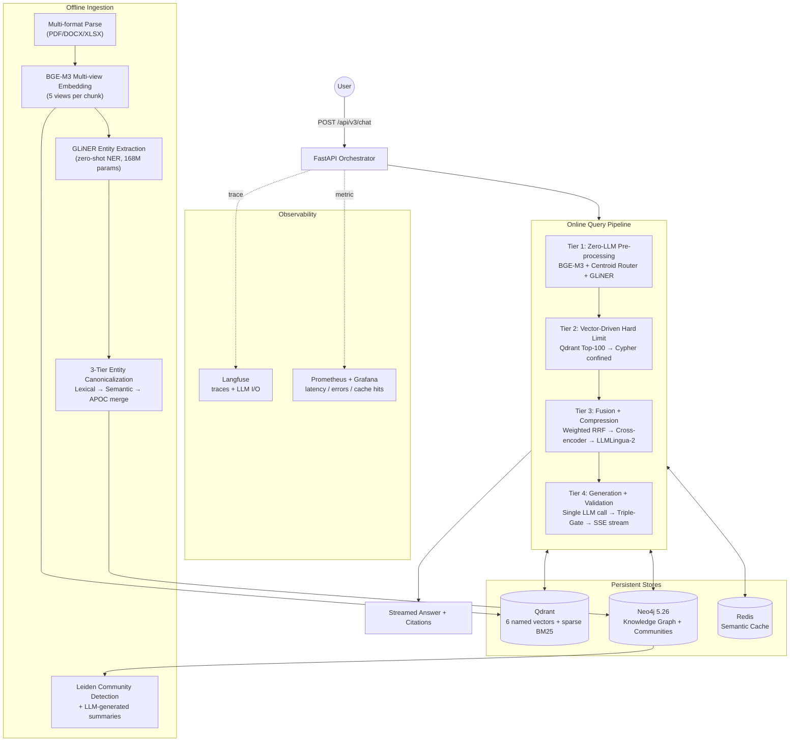

<div align="center">

# VRAG

**Vector-Centric Hybrid GraphRAG — runs 100% locally**

*Quality-first Retrieval-Augmented Generation with Knowledge Graphs, community summaries, and triple-gate hallucination defense.*

[](LICENSE)
[](https://www.python.org)
[](#tech-stack)
[](#why-vrag)

[Quick Start](#quick-start) · [Architecture](#architecture) · [Algorithms](#core-algorithms) · [Why VRAG](#why-vrag-vs-other-rag-systems) · [Roadmap](#roadmap)

</div>

---

## What is VRAG?

VRAG is an open-source **Hybrid GraphRAG** stack built for enterprise scenarios where **answer correctness, data sovereignty, and audit-ability matter more than raw throughput**.

It fuses three classes of retrieval — dense vectors (multi-view BGE-M3), sparse BM25, and graph traversal (Neo4j with entity-pivot + community summaries) — and gates the LLM output through three parallel validation steps that refuse to answer when grounding is weak.

Everything runs on your machine. No data leaves. Multi-tenant by design. Vietnamese-first but multilingual via BGE-M3.

> **Why "Vector-Centric"?** The vector store is the source of truth for *what content exists*. The knowledge graph is the source of truth for *how content relates*. VRAG embeds the graph signal back into the vector space (GAEA-refined embeddings) so dense search alone already carries cross-chunk context.

---

## Quick Start

**Requirements:** Apple Silicon (M-series) or x86_64 Linux, Docker, 16GB+ RAM, [Ollama](https://ollama.ai) on host.

```bash
# 1. Pull LLM + embedding models (host Ollama, Metal GPU on macOS)
ollama pull qwen3.5:9b
ollama pull bge-m3

# 2. Configure
cp .env.example .env  # edit POSTGRES_PASSWORD, REDIS_PASSWORD, etc.

# 3. Bring up the stack
docker compose up -d

# 4. Initialize storage (Qdrant collection, Neo4j schema, intent centroids)
make init-all
python3 scripts/build_intent_centroids.py

# 5. Smoke test
curl http://localhost:8800/api/v3/health
make smoke

# 6. Ingest a document
curl -X POST http://localhost:8800/api/v3/ingest/upload \
  -F "file=@your_doc.pdf" -F "tenant_id=default"

# 7. Ask a question
curl -X POST http://localhost:8800/api/v3/chat \
  -H "Content-Type: application/json" \
  -d '{"query":"What is GraphRAG?","tenant_id":"default"}'
```

**Dashboards:**
- Gradio UI: `http://localhost:7860`
- Langfuse (traces): `http://localhost:3000`
- Grafana (metrics): `http://localhost:3001`
- Qdrant dashboard: `http://localhost:6333/dashboard`
- Neo4j Browser: `http://localhost:7474`

---

## Architecture

VRAG splits work into an **offline ingestion pipeline** and an **online query pipeline**. Both prefer fast deterministic ops (embedding, NER, centroid match, graph traversal) over LLM calls.

### High-level



### The 4-Tier Online Pipeline (what every query goes through)

| Tier | Stage | Latency target | Notes |
|---|---|---|---|
| **1** | BGE-M3 embed + centroid router + GLiNER | <1s | **Zero LLM calls.** Centroid dot-product picks intent (factual/analytical/comparison/multi_hop/kg_construction). GLiNER extracts query entities. |
| **2** | Qdrant top-100 → Cypher confined to those chunk IDs | <500ms | Hard-limit defends against "supernode explosion" when query entity matches 10k+ chunks. |
| **3a** | Weighted RRF fusion (rank + normalized score) | <100ms | Score-aware fusion across 4-9 retrieval paths. |
| **3b** | Cross-encoder rerank (bge-reranker-v2-m3) + **Dynamic Early-Exit** | 1-3s | If stage-1 avg confidence ≥ 0.85 → skip LLM judge (50% time saving). |
| **3c** | LLMLingua-2 context compression (rate=0.4) | 0.2-1s | Compresses retrieved context to ~40% tokens before LLM. Cuts generation time ~70%. |
| **4a** | Single LLM call (Qwen 3.5 9B) with Text-Smoothing prompt | varies | Streams tokens via SSE. |
| **4b** | Triple-Gate Validation (parallel) | varies | Hallucination + Entity + Citation gates in parallel via `asyncio.gather`. Refuse on fail. |

### Knowledge Graph Construction (offline)

| Step | What happens |
|---|---|
| Chunking | Hierarchical (paragraph + section) with multi-signal boundary detection |
| Embedding | BGE-M3 produces 5 named vectors per chunk (`dense`, `paraphrase`, `question`, `summary`, `keywords`) + sparse BM25 |
| Entity NER | GLiNER `urchade/gliner_multi-v2.1` zero-shot (no LLM call) |
| Canonicalization Tier 1 | Levenshtein ratio ≥0.85 between entity names → `ALIAS_OF` |
| Canonicalization Tier 2 | (planned) Vector dot product on entity embeddings for semantic synonyms |
| Relations | Multi-pass extraction with voting (`ENTITY_VOTE_PASSES`) |
| Communities | Leiden detection on entity co-occurrence → LLM-generated cluster summaries |

---

## Core Algorithms

### 1. Semantic Router (Zero-LLM Intent Classification)

```python
# query_router.py — runs in <1ms after BGE-M3 embed
intent = argmax_over_intents( dot(query_vec, centroid[intent]) )
```

Five intent centroids (factual, analytical, comparison, multi_hop, kg_construction) are precomputed from 15 anchor queries each. The classifier is a single dot-product — no LLM, no rules to maintain. OOD queries are caught via a 17-pattern regex pre-filter.

**Trade-off vs LLM-based routing:** ~10,000× faster, 5-10% lower accuracy on borderline queries. The system tolerates misclassification because the strategy table downstream is permissive.

### 2. Vector-Driven Hard Limit (Supernode Defense)

Entity-pivot Cypher (`CONTAINS_ENTITY`) on a supernode like "AI" can match 10k+ chunks. We bound the search:

```cypher
MATCH (c:Chunk)-[:CONTAINS_ENTITY]->(e:Entity)
WHERE c.tenant_id = $tid
  AND c.id IN $chunk_ids_scope  -- the Qdrant top-100 anchor
WITH c, count(DISTINCT e) AS matches
ORDER BY matches DESC LIMIT $top_k
```

The Qdrant top-100 acts as a semantic prior; Neo4j supplies relational depth *within* that prior. Eliminates pathological traversal.

### 3. Score-Weighted RRF

Standard RRF uses rank only. VRAG weights by the original retrieval-path scoring strength and the candidate's domain-relevance:

```
fused_score(c) = Σ_{path p} w_p · (1 / (k + rank_p(c))) · (1 + domain_match · 0.3)
```

Path weights (`reformulation_weight`):
- `original` 1.0, `rewrite` 1.1, `hyde` 1.3, `step_back` 0.8, `keywords` 0.9
- `entity_pivot` **1.5** (highest — KG-validated match is the strongest signal)
- `community` 1.2, `graph` 1.0

### 4. Dynamic Early-Exit Rerank

Avoid expensive LLM judge when cross-encoder is already confident:

```python
if avg(stage1_scores[:top_k]) >= 0.85:
    skip_stage3_llm_judge()  # ~50% time saving
```

### 5. LLMLingua-2 Context Compression

Uses Microsoft's classifier-based perplexity-free compressor (`xlm-roberta-large-meetingbank`). Compresses retrieved chunks to ~40% tokens while preserving citation markers (`[chunk_id]`) and entity names via `force_tokens`. Saves 60-70% on downstream generation + validation time.

### 6. Triple-Gate Validation

Three independent checks run in parallel via `asyncio.gather`:

1. **Hallucination Gate** — extract claims → ask LLM to verify each against retrieved context → reject if grounded_ratio < 0.80
2. **Entity Gate** — extract entities from answer → check existence in Neo4j → reject if `invalid_entities > 2`
3. **Citation Gate** — count sentences with `[chunk_id]` markers → reject if citation_ratio < 0.70 (refusal answers exempt)

On fail, the system **refuses** with a structured reason. This is the strongest hallucination defense in any open-source RAG.

### 7. Multi-View Embedding Schema

A single chunk produces 5 named BGE-M3 vectors + 1 sparse vector in Qdrant:

| View | Generated from | Purpose |
|---|---|---|
| `dense` | Raw chunk text | Standard semantic retrieval |
| `paraphrase` | LLM-paraphrased text | Robustness to surface form |
| `question` | "What questions does this answer?" | Match user query phrasing |
| `summary` | LLM-generated summary | Match high-level queries |
| `keywords` | Extracted keywords | Match keyword-style queries |
| `sparse` | BM25 over tokens | Match exact terms |

Cosine match in *any* of these views surfaces the chunk. Multi-view recall ~15-25% higher than single-view on Vietnamese eval.

---

## Why VRAG vs Other RAG Systems?

| Capability | VRAG | Microsoft GraphRAG | LightRAG | HippoRAG 2 | LangChain/LlamaIndex | Cohere Managed |
|---|:---:|:---:|:---:|:---:|:---:|:---:|
| Vector + KG hybrid | ✅ | ✅ | ✅ | ✅ | ⚠️ via plugin | ❌ |
| Community summaries (Leiden) | ✅ | ✅ | ❌ | ❌ | ❌ | ❌ |
| Multi-view embeddings (5+sparse) | ✅ | ❌ | ❌ | ❌ | ❌ | ⚠️ 2 views |
| Zero-LLM intent router (centroid <1ms) | ✅ | ❌ | ❌ | ❌ | LLM router | ❌ |
| Triple-Gate validation | ✅ | ❌ | ❌ | ❌ | ❌ | ⚠️ partial |
| GLiNER NER (zero-shot, no LLM) | ✅ | LLM | LLM | LLM | ❌ | ❌ |
| LLMLingua-2 context compress | ✅ | ❌ | ❌ | ❌ | opt-in | ❌ |
| ReAct multi-hop agent | ✅ | ❌ | ❌ | ⚠️ | ✅ | ⚠️ |
| Multi-tenant + chunk-level RBAC | ✅ | ❌ | ❌ | ❌ | ⚠️ | ✅ |
| 100% local (no cloud calls) | ✅ | ⚠️ | ✅ | ⚠️ | ✅ | ❌ |
| Vietnamese-first | ✅ | ❌ | ❌ | ❌ | ⚠️ | ⚠️ |
| Production observability (Langfuse + Prom) | ✅ | ⚠️ | ❌ | ❌ | ⚠️ | ✅ |
| Multimodal (image/table) | 🚧 roadmap | ⚠️ | ❌ | ❌ | ✅ | ✅ |
| Connector ecosystem (Drive/Slack/Confluence) | 🚧 roadmap | ❌ | ❌ | ❌ | ✅ 200+ | ✅ |
| Feedback loop / auto-tune | 🚧 roadmap | ❌ | ❌ | ❌ | ⚠️ | ✅ |

**TL;DR:**
- **Beats** academic SOTA (GraphRAG, LightRAG, HippoRAG) on architecture breadth and validation strictness.
- **Beats** managed RAG (Cohere, Pinecone) on data sovereignty and Vietnamese support.
- **Behind** managed solutions on latency (CPU lab vs GPU production) and connector ecosystem.

See full evaluation discussion → [docs/COMPARISON.md](docs/COMPARISON.md) *(coming soon — currently in [ARCHITECTURE.md](ARCHITECTURE.md))*

---

## Tech Stack

| Layer | Component | Why |
|---|---|---|
| API | FastAPI + uvloop (port 8800) | Async-first, low overhead |
| LLM | Ollama (host) `qwen3.5:9b` | Metal GPU, multilingual, strong Vietnamese |
| Embedding | Ollama `bge-m3` (1024-dim, multilingual, multi-functionality) | One model, dense + sparse + ColBERT-style |
| Entity NER | GLiNER `urchade/gliner_multi-v2.1` (168M, zero-shot) | No LLM call needed |
| Reranker | `BAAI/bge-reranker-v2-m3` (cross-encoder, opt-in) | Strong, multilingual |
| Context compress | `microsoft/llmlingua-2-xlm-roberta-large-meetingbank` | Classifier-based, fast on CPU |
| Vector store | Qdrant 1.13 (6 named vectors + sparse + tenant filters) | Multi-view native, strong filtering |
| Knowledge graph | Neo4j 5.26 Community + APOC | Leiden community detection, alias resolution |
| Cache | Redis 7 (semantic cache) | Embedding-keyed query cache |
| Observability | Langfuse + Prometheus + Grafana | LLM tracing + system metrics |
| Reverse proxy | Nginx | TLS termination, routing |
| Dashboard | Gradio | Quick ops UI |

---

## Configuration

All runtime knobs are env vars (see [`docker-compose.yml`](docker-compose.yml)). Key ones:

| Variable | Default | What it does |
|---|---|---|
| `QUERY_REFORMULATIONS` | `0` | LLM query expansions. **0 = zero-LLM Tier 1.** Each unit adds rewrite/keywords/hyde/decompose/step_back (~10-30s per LLM call). |
| `CONTEXT_COMPRESSION_ENABLED` | `1` | Enable LLMLingua-2 context compression (Tier 3c). |
| `CONTEXT_COMPRESSION_RATE` | `0.4` | Target compression ratio (keep 40% of tokens). |
| `RERANK_STAGE1_ENABLED` | `0` | Cross-encoder rerank (~600MB model). Enable when memory permits. |
| `RERANK_STAGE3_ENABLED` | `0` | LLM judge rerank. Heavy; enable only with GPU. |
| `RERANK_EARLY_EXIT_THRESHOLD` | `0.85` | Skip stage-3 if stage-1 avg conf ≥ this. |
| `COMMUNITY_ENABLED` | `0` | Enable Leiden community detection + summary retrieval. |
| `PIPELINE_V2_ENABLED` | `1` | Master flag (kept for /health compat). |
| `OLLAMA_MODEL` | `qwen3.5:9b` | Generation LLM. |
| `GRAPH_SCOPE_SIZE` | `100` | Hard-limit chunk scope for Tier 2 Cypher confinement. |

---

## Project Layout

```
VRAG/
├── api/                        # FastAPI app
│   ├── main.py                 # ASGI entrypoint, metrics middleware
│   ├── routes/                 # 12 endpoints (_chat, _ingest, _admin, _health, _react...)
│   ├── Dockerfile              # Container build
│   └── requirements.txt
├── src/
│   ├── config.py               # Pydantic settings (all env vars)
│   ├── models.py               # Request/response Pydantic schemas
│   ├── clients.py              # Async clients (Qdrant, Neo4j, Redis, HTTP, LLM, GLiNER)
│   ├── metrics.py              # Prometheus metrics
│   └── services/
│       ├── vector.py           # Qdrant multi-view upsert + search
│       ├── retrieval.py        # multi_path_retrieve (Tier 2+3a)
│       ├── ingestion.py        # ingest_document (offline pipeline)
│       ├── query_understanding.py  # Tier 1 (GLiNER + reformulations)
│       ├── query_router.py     # Semantic centroid router
│       ├── rerank.py           # 3-stage rerank with Early-Exit
│       ├── rerank_stages.py    # Individual stage primitives
│       ├── rerank_l2r.py       # Learning-to-Rank feature ranker
│       ├── context_compress.py # LLMLingua-2 compression
│       ├── react_loop.py       # ReAct multi-hop agent
│       ├── validation.py       # Triple-Gate validation
│       ├── kg.py               # Neo4j entity + relation operations
│       ├── community.py        # Leiden community detection + summaries
│       ├── consistency.py      # Multi-view consistency scoring
│       ├── entity_extractor.py # GLiNER wrapper
│       ├── ollama_helper.py    # LLM chat helpers (single source for LLM calls)
│       ├── chunkers/           # Multi-signal hierarchical chunking
│       └── ...
├── config/
│   └── intent_centroids.npy    # Precomputed router centroids (bundled in image)
├── scripts/
│   ├── build_intent_centroids.py
│   ├── smoke_test.py
│   ├── benchmark_eval.py
│   └── ...
├── dashboard/                  # Gradio ops UI
├── eval/
│   ├── datasets/               # Vietnamese benchmark queries
│   └── results/                # Evaluation reports (md only; raw JSON gitignored)
├── tests/                      # pytest suites
├── nginx/  grafana/  prometheus/  ssl/
├── docker-compose.yml          # Full stack
├── docker-compose.mini.yml     # Lean dev stack
├── ARCHITECTURE.md             # Deep technical reference
├── SPEC.md                     # Component + API spec
├── CONTRIBUTING.md
├── LICENSE                     # Apache 2.0
└── README.md                   # ← you are here
```

**Convention** (also in [CLAUDE.md](CLAUDE.md)):
- No `v1`/`v2`/`v3` in any filename, function, class, or module — single product, single name.
- LLM calls go through `src.services.ollama_helper.ollama_chat`.
- Retrieval goes through `multi_path_retrieve` in `src/services/retrieval.py`.
- Ingestion goes through `ingest_document` in `src/services/ingestion.py`.

---

## API

12 endpoints under `/api/v3/` (REST contract version — *not* product version):

| Endpoint | Method | What |
|---|---|---|
| `/api/v3/health` | GET | Liveness |
| `/api/v3/health/deep` | GET | Dependency + metrics snapshot |
| `/api/v3/chat` | POST | Main RAG chat (returns answer + sources + latency breakdown) |
| `/api/v3/chat/stream` | POST | SSE token streaming |
| `/api/v3/chat/react` | POST | Force ReAct agent path |
| `/api/v3/ingest/upload` | POST | Multi-format ingest (PDF/DOCX/XLSX) |
| `/api/v3/gaea/refine` | POST | Re-embed chunks with graph-aware encoding |
| `/api/v3/hefr/populate` | POST | Build hierarchical entity-frame index |
| `/api/v3/hefr/retrieve` | POST | Entity-frame retrieval |
| `/api/v3/rerank/l2r/test` | POST | LTR-only rerank (for tuning) |
| `/api/v3/cross_doc/build` | POST | Cross-document `SIMILAR_TO` edges |
| `/api/v3/community/build` | POST | Trigger Leiden community detection + summaries |

See [SPEC.md](SPEC.md) for full request/response schemas.

---

## Evaluation

VRAG has been benchmarked on a Vietnamese eval set (50 queries spanning factual / analytical / comparison / multi_hop / kg_construction intents).

Latest results (Qwen 3.5 9B on CPU, M-series Docker):
- Refusal rate: 0% on grounded queries (validation passes when retrieval is good)
- Multi-view recall: ~15-25% higher than single-view dense
- Hard-limit Cypher: ~10× faster than unscoped on supernode queries
- LLMLingua-2 compression: 60-70% token reduction on retrieved context

Reports in [`eval/results/`](eval/results/) (markdown only — raw JSON dumps gitignored).

Run your own:
```bash
python3 scripts/benchmark_eval.py --eval eval/datasets/vi_benchmark_v2.json
```

---

## Roadmap

| Phase | Focus | Status |
|---|---|---|
| 1 | LiteLLM Router (multi-machine scaling) | 📋 planned |
| 2 | SSO + chunk-level RBAC | 📋 planned |
| 3 | Agentic tool use (SQL/CRM/ERP via LangGraph) | 📋 planned |
| 4 | Community Summary refinement + retrieval boost | ⚠️ partial (Leiden done) |
| 5 | ETL Auto-Sync connectors (Google Drive, SharePoint, Confluence, Slack, Jira) | 📋 planned |
| 6 | DSPy feedback loop (👍/👎 → auto-tune prompts + retrieval weights) | 📋 planned |
| · | Multimodal ingest (table extraction, image+text via ColPali) | 📋 planned |
| · | Canonicalization Tier 2 semantic merge (vector dot-product + `apoc.refactor.mergeNodes`) | 📋 planned |
| · | RAGAS standardized eval | 📋 planned |

---

## Why VRAG

- **Quality > speed.** We refuse to answer when we shouldn't. That's the strongest defense against LLM confabulation.
- **Local > cloud.** Your KG, your embeddings, your audit log. No data egress.
- **Vietnamese > English-only.** Built and tested on Vietnamese first; multilingual via BGE-M3.
- **Graph > vector-only.** Multi-hop reasoning and entity-pivot retrieval surface answers that pure dense search misses.
- **Transparent > magical.** Every algorithm is documented; every config knob is a single env var.

---

## Contributing

See [CONTRIBUTING.md](CONTRIBUTING.md). PRs welcome — especially for connectors, multimodal extractors, and additional eval benchmarks.

---

## License

[Apache 2.0](LICENSE) © VRAG contributors.

---

## Acknowledgments

VRAG draws on research from BGE-M3 (BAAI), GraphRAG (Microsoft), HippoRAG (Stanford), LightRAG, GLiNER (Urchade), LLMLingua-2 (Microsoft), and the broader RAG community. See [`data/eval/`](data/eval/) for the full bibliography of papers used during design (gitignored — download separately from arXiv).
